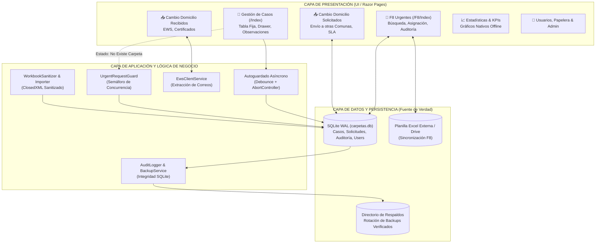
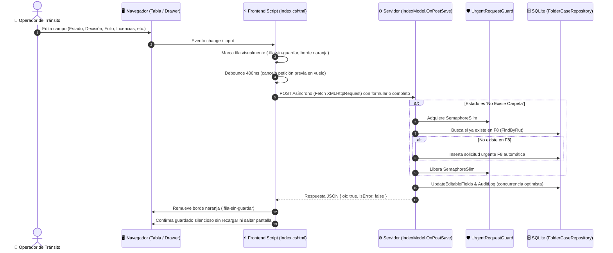
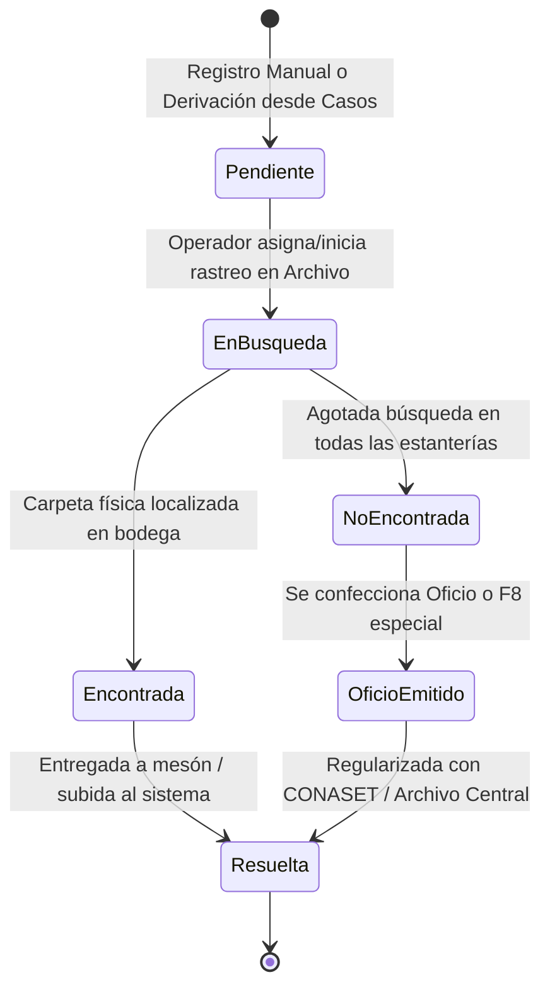
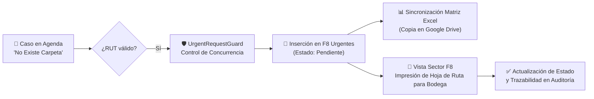
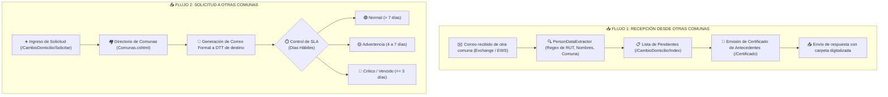
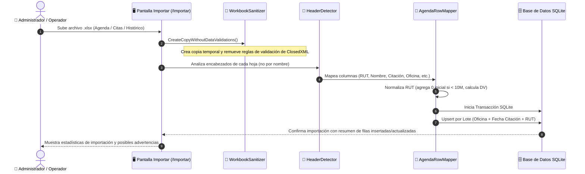
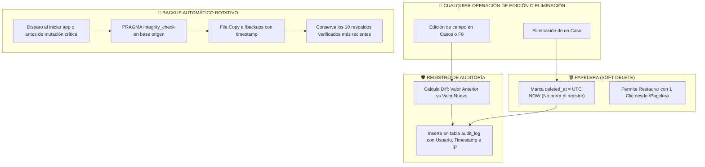
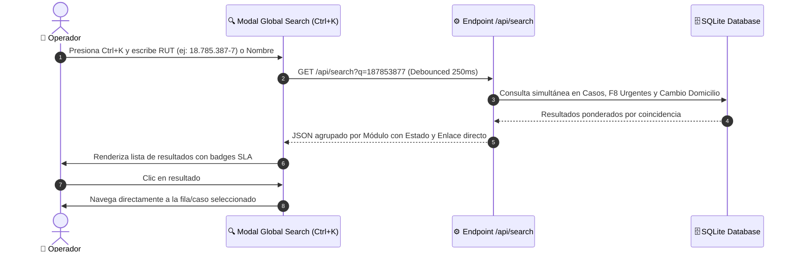

# Manual Técnico y Operativo de Procesos del Sistema
## Sistema de Gestión de Licencias, Carpetas y Urgencias F8

---

## 1. Arquitectura General y Resumen Ejecutivo

El sistema **Licencias & Carpetas** es una solución enterprise diseñada para la **Dirección de Tránsito Municipal**, orientada a digitalizar, agilizar y auditar el ciclo de vida de los expedientes de licencias de conducir, solicitudes urgentes de archivo (F8) y trámites intermunicipales de cambio de domicilio.

---

## 2. Proceso 1: Gestión de Casos y Agendas Diarias (Módulo Casos)

### Descripción del Proceso
Permite a los operadores gestionar las citaciones diarias de licencias de conducir. Cada fila representa a un postulante/contribuyente citado en una fecha y oficina determinada.

### Paso a Paso Operativo:
1. **Filtro y Navegación**: El usuario selecciona Oficina, Año, Mes o busca por RUT/Nombre. La vista mantiene el estado de paginación (`size=100`, `p=1`).
2. **Edición en Tabla o Drawer**:
   - Se puede editar inline directamente en la celda correspondiente.
   - O abrir el **Drawer Lateral Master-Detail** haciendo clic en la fila para ver toda la información concentrada.
3. **Observaciones Flotantes**:
   - Al pulsar el ícono 📝/🗒️ junto al RUT, se despliega un panel fijo flotante (`position: fixed`) que no desborda la tabla y enfoca el texto para edición rápida.
4. **Autoguardado**:
   - Cada cambio activa el autoguardado asíncrono debounced (400 ms).
   - Si el operador presiona Enter, el envío se intercepta para evitar recargas de página y mantener la posición exacta de scroll (`scroll-preserve.js`).

---

## 3. Proceso 2: Flujo de Casos F8 Urgentes (Búsqueda de Carpetas)

### Descripción del Proceso
Cuando una carpeta física no es encontrada en el archivo municipal durante la citación de un usuario, el caso pasa a estado `NoExisteCarpeta` y se activa el flujo urgente F8.

### Paso a Paso Operativo:
1. **Detección**: Al marcar `No Existe Carpeta` en la agenda diaria, el backend crea de forma atómica y segura (bajo semáforo) la solicitud en F8.
2. **Asignación & Búsqueda**: El personal de archivo consulta el módulo `/F8/Index` o imprime `/F8/SectorF8` para acudir a las bodegas físicas.
3. **Resolución**: Al encontrar la carpeta, se actualiza el estado a `Encontrada` o `Resuelta`, registrando fecha de última carpeta y código F8 correspondiente.

---

## 4. Proceso 3: Cambio de Domicilio (Intercomunal)

### Descripción del Proceso
Gestiona las solicitudes de antecedentes de conductores que se trasladaron desde o hacia otra comuna.

### Paso a Paso Operativo:
1. **Recepción Automática**: El servicio en segundo plano conecta vía EWS y extrae automáticamente los pedidos entrantes desde el buzón institucional.
2. **Emisión de Certificados**: Se revisa el folio y se descarga el certificado PDF oficial para adjuntar a la respuesta.
3. **Solicitudes Salientes**: El módulo `Solicitar` cuenta con un semáforo visual de SLA basado en días hábiles chilenos (excluyendo feriados y fines de semana), alertando casos próximos a vencer.

---

## 5. Proceso 4: Importación Masiva & Sanitización de Planillas Excel

### Descripción del Proceso
Ingesta planillas Excel históricas o matrices mensuales sin riesgo de corrupción ni bloqueos por validaciones de datos complejas.

---

## 6. Proceso 5: Auditoría, Papelera & Respaldos Automáticos

### Descripción del Proceso
Garantiza la trazabilidad total de modificaciones y la integridad de los datos ante cortes de energía o errores de operación.

---

## 7. Proceso 6: Búsqueda Global Unificada (Ctrl+K)

### Descripción del Proceso
Permite a los operadores localizar inmediatamente a cualquier persona en cualquiera de los módulos sin tener que cambiar de pantalla manualmente.

---

## 8. Resumen de Estándares de Diseño y UI

| Elemento | Token / Clase | Estándar Visual |
| :--- | :--- | :--- |
| **Fondo General** | `--color-bg` | `#f8fafc` (Slate 50, limpio y moderno) |
| **Color Institucional** | `--color-primary` | `#0f2e4a` (Azul profundo municipal) |
| **Acento Interactivo** | `--color-accent` | `#2563eb` (Cobalto / Índigo accesible) |
| **Estado Subida/OK** | `--color-uploaded` | `#059669` / `#ecfdf5` (Esmeralda suave) |
| **Estado Pendiente** | `--color-pending` | `#d97706` / `#fffbeb` (Ámbar cálido) |
| **Estado Revisión** | `--color-review` | `#e11d48` / `#fff1f2` (Carmesí controlado) |
| **Copiado de RUT** | `_Layout.js` | Sin puntos, con guión, con cero inicial si `< 10M` (ej: `09868496-4`) |
| **Scroll de Pantalla** | `scroll-preserve.js` | Preservación exacta de posición X/Y tras recargas y acciones |
