# Análisis técnico completo del sistema — Dependencias e interconexiones

**Proyecto:** LicenciasCarpetas (Depto. Licencias de Conducir — I. Municipalidad de Valparaíso)
**Fecha del análisis:** 2026-09-03
**Rama analizada:** `main` — commit `4c88183`
**Alcance:** grafo completo de dependencias externas (NuGet + framework + servicios), grafo de
inyección de dependencias interno, arquitectura por módulos, esquema de base de datos y flujos
paso a paso.

---

## Índice

1. [Resumen ejecutivo](#1-resumen-ejecutivo)
2. [Stack y entorno de ejecución](#2-stack-y-entorno-de-ejecución)
3. [Dependencias externas — paquetes NuGet](#3-dependencias-externas--paquetes-nuget)
4. [Dependencias del framework (.NET / ASP.NET Core)](#4-dependencias-del-framework-net--aspnet-core)
5. [Dependencias de infraestructura y servicios externos](#5-dependencias-de-infraestructura-y-servicios-externos)
6. [Arquitectura interna — capas y módulos](#6-arquitectura-interna--capas-y-módulos)
7. [Grafo de inyección de dependencias (contenedor DI)](#7-grafo-de-inyección-de-dependencias-contenedor-di)
8. [Módulo A — Gestión de Licencias (Casos)](#8-módulo-a--gestión-de-licencias-casos)
9. [Módulo B — F8 Urgentes](#9-módulo-b--f8-urgentes)
10. [Módulo C — Cambio de Domicilio (Recibidas)](#10-módulo-c--cambio-de-domicilio-recibidas)
11. [Módulo D — Cambio de Domicilio (Solicitadas)](#11-módulo-d--cambio-de-domicilio-solicitadas)
12. [Módulo transversal — Autenticación y Dashboard](#12-módulo-transversal--autenticación-y-dashboard)
13. [Esquema de base de datos](#13-esquema-de-base-de-datos)
14. [Flujos paso a paso](#14-flujos-paso-a-paso)
15. [Configuración](#15-configuración)
16. [Despliegue](#16-despliegue)
17. [Pruebas](#17-pruebas)
18. [Matriz de interconexión entre componentes](#18-matriz-de-interconexión-entre-componentes)
19. [Observaciones y riesgos técnicos](#19-observaciones-y-riesgos-técnicos)

---

## 1. Resumen ejecutivo

El sistema es **una sola aplicación web ASP.NET Core** (`Microsoft.NET.Sdk.Web`, `net10.0`) que
reemplaza el libro Excel *"DETALLE CARPETAS DEPTO. LICENCIAS DE CONDUCIR"*. Corre **on-premise** en
el equipo del departamento, escucha HTTP en el puerto `5010` y guarda todo su estado en **un único
archivo SQLite** (`data/carpetas.db`).

Dentro de ese proceso conviven **cuatro módulos funcionales** detrás del mismo login:

| Módulo | Ruta base | Fuente de datos externa | Salida externa |
| --- | --- | --- | --- |
| Gestión de Licencias (Casos) | `/` | Excel maestro (lectura) | Export `.xlsx`, PDF impreso |
| F8 Urgentes | `/F8` | Excel "URGENTES DIARIOS" + Excel "matriz" | Correo SMTP, escritura al Excel matriz (deshabilitada) |
| Cambio de Domicilio — Recibidas | `/CambioDomicilio` | Buzón Exchange vía EWS | Correo vía EWS, CSV, toast Windows |
| Cambio de Domicilio — Solicitadas | `/CambioDomicilio/Solicitar` | Excel opcional | Correo vía EWS |

**Filosofía de dependencias:** el proyecto minimiza paquetes de terceros. Solo hay **3 paquetes
NuGet declarados explícitamente** (ClosedXML, Microsoft.Data.Sqlite, SQLitePCLRaw). Todo lo demás
—web, autenticación, HTTP, XML, SMTP, cifrado, compresión— viene del framework compartido. El
cliente de Exchange (EWS) y las notificaciones toast de Windows están **escritos a mano** para no
arrastrar dependencias pesadas ni atar el proyecto a un target de sistema operativo.

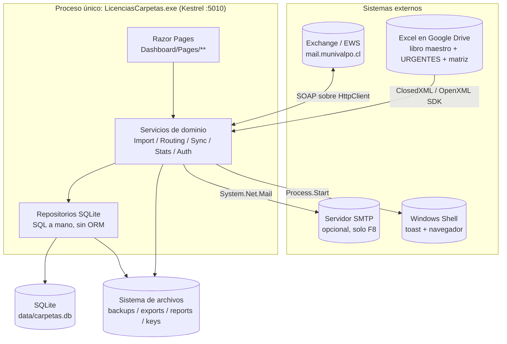

---

## 2. Stack y entorno de ejecución

| Elemento | Valor | Dónde se define |
| --- | --- | --- |
| SDK del proyecto | `Microsoft.NET.Sdk.Web` | `LicenciasCarpetas.csproj` |
| Target framework | `net10.0` | `csproj` |
| Lenguaje | C# con `Nullable` + `ImplicitUsings` habilitados | `csproj` |
| Servidor web | Kestrel, solo HTTP, `http://0.0.0.0:5010` | `appsettings.json → Kestrel:Endpoints` |
| UI | Razor Pages, root en `/Dashboard/Pages` | `Program.cs` (`AddRazorPages`) |
| Persistencia | SQLite, archivo único, SQL escrito a mano (sin EF/ORM) | `Persistence/`, cada módulo `*/Data/` |
| Autenticación | Cookie propia (`.LicenciasCarpetas.Auth`), hash PBKDF2 | `Program.cs`, `Dashboard/Auth/` |
| Icono embebido | `wwwroot\img\app-icon.ico` (en el exe) | `csproj → ApplicationIcon` |
| Runtime de publicación | `win-x64`, self-contained, single-file (~109 MB) | `deploy/publish.ps1` |
| Contenedor (alternativa) | `mcr.microsoft.com/dotnet/aspnet:10.0` | `Dockerfile` |
| Assembly de pruebas | visible vía `InternalsVisibleTo` | `csproj` |

**Rutas ancladas al directorio del ejecutable.** `Program.cs` fija `ContentRootPath =
AppContext.BaseDirectory` y resuelve manualmente contra esa carpeta:
`Carpetas:SqliteDbPath`, `CambioDomicilio:ComunaDirectoryCsvPath`, `CambioDomicilio:ReportCsvPath`
y `CambioDomicilio:SolicitarMatrizExcelPath` (mediante `CambioDomicilioPathResolver`). Motivo:
que la ruta relativa signifique lo mismo se lance como se lance (doble clic, acceso directo, Tarea
Programada, `dotnet run`).

**Comandos de línea de comandos** (se ejecutan en lugar de levantar el servidor):

| Argumento | Acción |
| --- | --- |
| `--add-user <u>` / `--remove-user <u>` | Alta/baja de cuenta (contraseña por consola o `LC_ADMIN_PASSWORD`) |
| `--reset-password <u>` / `--list-users` | Recuperación de acceso desde el propio equipo |
| `--import "<ruta.xlsx>"` | Importación masiva (mismo código que la pantalla `/Importar`) |
| `--test-ews` | Diagnóstico de conexión al buzón Exchange, imprime el error real |
| `--open-browser` | Abre `http://localhost:5010` en el navegador ~1,5 s después de arrancar |

---

## 3. Dependencias externas — paquetes NuGet

### 3.1 Paquetes declarados en el proyecto principal

`src/LicenciasCarpetas/LicenciasCarpetas.csproj`:

| Paquete | Versión | Rol en el sistema |
| --- | --- | --- |
| **ClosedXML** | `0.105.0` | Lectura/escritura de `.xlsx` de alto nivel. Se usa para: importar el libro maestro, importar el histórico F8 "URGENTES DIARIOS", leer el Excel de "Solicitar Cambio de Domicilio" y generar el export de la pantalla Casos. |
| **Microsoft.Data.Sqlite** | `10.0.9` | Proveedor ADO.NET para SQLite. Es el único acceso a la base de datos: cada repositorio abre su propia `SqliteConnection` con `Data Source=<ruta>`. |
| **SQLitePCLRaw.bundle_e_sqlite3** | `3.0.3` | Empaqueta el motor nativo SQLite (`e_sqlite3`) y lo registra como proveedor. Sin este bundle, `Microsoft.Data.Sqlite` no tendría binario nativo con qué hablar. |
| **Microsoft.NET.ILLink.Tasks** | `10.0.8` | Inyectado por el SDK para el *trimming* durante `dotnet publish` (single-file self-contained). No es código de negocio. |

### 3.2 Árbol de dependencias transitivas resuelto

Extraído de `obj/project.assets.json` (target `net10.0`):

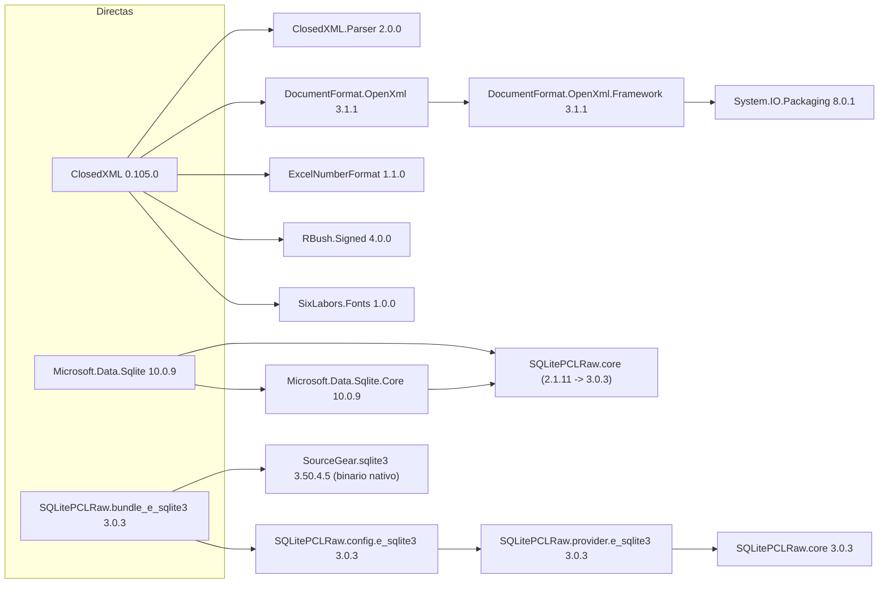

| Paquete transitivo | Versión resuelta | Traído por | Para qué sirve |
| --- | --- | --- | --- |
| `ClosedXML.Parser` | 2.0.0 | ClosedXML | Parser de fórmulas de Excel |
| `DocumentFormat.OpenXml` | 3.1.1 | ClosedXML (y uso directo en F8) | SDK OpenXML de bajo nivel. **También referenciado directamente en el código** por `F8/Matriz/MatrizSyncService.cs` para abrir el Excel matriz sin tocar sus `dataValidation` |
| `DocumentFormat.OpenXml.Framework` | 3.1.1 | DocumentFormat.OpenXml | Núcleo del SDK OpenXML |
| `System.IO.Packaging` | 8.0.1 | OpenXml.Framework | Lectura del contenedor OPC (zip) de los `.xlsx` |
| `ExcelNumberFormat` | 1.1.0 | ClosedXML | Formateo de números/fechas según el formato de celda |
| `RBush.Signed` | 4.0.0 | ClosedXML | Índice espacial R-tree (rangos de celdas) |
| `SixLabors.Fonts` | 1.0.0 | ClosedXML | Métricas de fuentes para `AdjustToContents()` (autoajuste de ancho de columna en el export) |
| `Microsoft.Data.Sqlite.Core` | 10.0.9 | Microsoft.Data.Sqlite | Implementación ADO.NET sin el binario nativo |
| `SQLitePCLRaw.core` | 3.0.3 (gana sobre 2.1.11) | ambos lados | API P/Invoke sobre el motor nativo |
| `SQLitePCLRaw.config.e_sqlite3` | 3.0.3 | bundle | Registra automáticamente el proveedor `e_sqlite3` al iniciar |
| `SQLitePCLRaw.provider.e_sqlite3` | 3.0.3 | config | Provider concreto |
| `SourceGear.sqlite3` | 3.50.4.5 | bundle | **Binario nativo** `e_sqlite3.dll` (motor SQLite compilado) |

> **Nota de resolución de versiones:** `Microsoft.Data.Sqlite 10.0.9` pide `SQLitePCLRaw.core
> 2.1.11`, pero el bundle fuerza `3.0.3`. NuGet resuelve a la mayor (`3.0.3`) para toda la app. Es
> un *upgrade* deliberado del proyecto y funciona, pero conviene tenerlo presente al actualizar.
> `deploy/publish.ps1` incluso copia a mano `e_sqlite3.dll` junto al `.exe` por si el publish
> single-file no la extrae.

### 3.3 Paquetes del proyecto de pruebas

`tests/LicenciasCarpetas.Tests/LicenciasCarpetas.Tests.csproj` (`Microsoft.NET.Sdk`, `net10.0`):

| Paquete | Versión | Rol |
| --- | --- | --- |
| `xunit` | 2.9.3 | Framework de pruebas |
| `xunit.runner.visualstudio` | 3.1.4 | Runner para `dotnet test` / IDE |
| `Microsoft.NET.Test.Sdk` | 17.14.1 | Infraestructura de host de pruebas |
| `Microsoft.AspNetCore.Mvc.Testing` | 10.0.0 | `WebApplicationFactory` para pruebas de integración de páginas (usa `public partial class Program`) |
| `coverlet.collector` | 6.0.4 | Cobertura de código |

El proyecto de pruebas referencia al principal por `ProjectReference` y accede a sus tipos
`internal` gracias a `<InternalsVisibleTo Include="LicenciasCarpetas.Tests" />`.

---

## 4. Dependencias del framework (.NET / ASP.NET Core)

El `csproj` declara dos *framework references* implícitas del SDK Web:

- **`Microsoft.AspNetCore.App`** — framework compartido de ASP.NET Core
- **`Microsoft.NETCore.App`** — biblioteca base de .NET

De ese framework compartido el código usa, explícitamente:

| Namespace / API | Dónde | Para qué |
| --- | --- | --- |
| `Microsoft.AspNetCore.Builder` / `WebApplication` | `Program.cs` | Host, pipeline, arranque |
| `Microsoft.Extensions.DependencyInjection` | `Program.cs` (todo `builder.Services`) | Contenedor DI |
| `Microsoft.Extensions.Configuration` (+ `Json` + `EnvironmentVariables`) | `Program.cs` | Carga de `appsettings*.json`, `appsettings.Local.json`, variables de entorno |
| `Microsoft.Extensions.Options` (`IOptions<SmtpOptions>`, `AddOptions().Bind()`) | F8 SMTP | Binding tardío de `Smtp:*` |
| `Microsoft.Extensions.Logging` (`ILogger<T>`) | Servicios EWS, routing, sync, notificaciones | Log a consola |
| `Microsoft.AspNetCore.Authentication.Cookies` | `Program.cs`, `Login.cshtml.cs`, `Logout` | Sesión por cookie, 30 días, sliding |
| `Microsoft.AspNetCore.Authorization` (políticas `CambioDomicilioAccess`, `F8Access`) | `Program.cs`, `[Authorize(Policy=…)]` en PageModels | Control de acceso por *claim* |
| `Microsoft.AspNetCore.DataProtection` (`PersistKeysToFileSystem`) | `Program.cs` | Cifrado de la cookie de auth; llaves en `<dir db>/keys` |
| `Microsoft.AspNetCore.HttpOverrides` (`ForwardedHeaders`) | `Program.cs` | Soporte de proxy inverso (`X-Forwarded-For/Proto`) para Docker |
| `Microsoft.AspNetCore.Mvc.RazorPages` (`PageModel`) | Todos los `*.cshtml.cs` | Modelo de página |
| `System.Net.Http` (`HttpClient`, `AuthenticationHeaderValue`) | `CambioDomicilio/Ews/EwsClient.cs` | Transporte SOAP a Exchange, auth Basic sobre TLS, reintentos con backoff |
| `System.Xml.Linq` (`XDocument`, `XElement`, `XNamespace`) | `CambioDomicilio/Ews/EwsMessages.cs`, `EwsResponseParser.cs` | Construcción y parseo de sobres SOAP EWS (escapado estructural, sin interpolar en markup) |
| `System.Net.Mail` (`SmtpClient`, `MailMessage`, `Attachment`) | `F8/Services/SmtpEmailSender.cs` | Envío de correo F8 por SMTP |
| `System.Security.Cryptography` (`Rfc2898DeriveBytes.Pbkdf2`, `RandomNumberGenerator`, `CryptographicOperations.FixedTimeEquals`) | `Dashboard/Auth/PasswordHasher.cs` | Hash de contraseñas PBKDF2-SHA256, 210 000 iteraciones, sal por usuario |
| `System.Text.RegularExpressions` (`[GeneratedRegex]`) | `CambioDomicilio/Extraction/PersonDataExtractor.cs`, `RutValidator` | Extracción de RUT y nombre desde el cuerpo/asunto de correos de comunas |
| `System.IO.Compression` (`ZipFile`, `ZipArchiveMode.Update`) | `Import/WorkbookSanitizer.cs` | Abrir el `.xlsx` como zip y borrar los nodos `dataValidation` que ClosedXML rechaza |
| `System.Diagnostics.Process` | `Program.cs` (`--open-browser`), `WindowsToastNotificationChannel` | Abrir el navegador; lanzar `powershell.exe` para el toast |
| `System.Globalization` / `System.Text` (`NormalizationForm.FormD`) | `Domain/TextNormalizer.cs`, `F8` `NormalizeHeader` | Quitar tildes para comparar catálogos y encabezados |

---

## 5. Dependencias de infraestructura y servicios externos

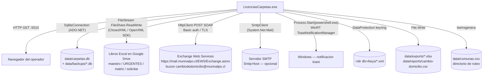

### 5.1 Exchange Web Services (EWS) — cliente propio

No hay paquete `Microsoft.Exchange.WebServices`. Todo el cliente son ~450 líneas propias en
`CambioDomicilio/Ews/`:

| Archivo | Responsabilidad |
| --- | --- |
| `EwsClient.cs` (`IEwsClient`) | Transporte: un `HttpClient` con `Authorization: Basic`, `POST` de un string SOAP, reintentos exponenciales (2→4→8 s, 4 intentos) ante `408/429/5xx` y errores de red, timeout 100 s. Construcción **perezosa**: si falta `CambioDomicilio:Ews`, lanza `InvalidOperationException` recién cuando alguien lo usa, no al arrancar. |
| `EwsMessages.cs` | Constructores de sobres SOAP con `XElement` (escapado estructural). Operaciones: `FindFolder`, `FindItem`, `FindItem` por `InternetMessageId`, `GetItem` (lotes de 50), `MoveItem`, `UpdateItem` (flag leído/no leído), `CreateItem` (`SendAndSaveCopy`). Versión de servidor: `Exchange2013_SP1`. |
| `EwsResponseParser.cs` | Parsea las respuestas: `EnsureSuccess` (lanza si `ResponseClass="Error"`), extrae `ItemId/ChangeKey`, `FolderId`, y `IncomingEmail` (message-id, conversation-id, asunto, remitente, cuerpo texto, fecha recepción). |
| `EwsEmailReader.cs` (`IEmailReader` + `IEmailMover`) | Orquestación: resuelve carpeta por nombre (con caché que se auto-purga si el id queda obsoleto), lista items, los trae en lotes, mueve un correo entre carpetas y lo marca no leído. |
| `EwsMailSender.cs` (`IMailSender`) | Envía un correo (`CreateItem`) — lo usa el flujo de confirmación y de solicitud saliente. |

### 5.2 SMTP — solo F8

`F8/Services/SmtpEmailSender.cs` implementa `IEmailSender` con `System.Net.Mail.SmtpClient`.
Configuración en la sección `Smtp` (`SmtpOptions`: `Host`, `Port` 587, `EnableSsl`, `Username`,
`Password`, `FromAddress`, `FromDisplayName`). **No se valida al arranque** (`AddOptions().Bind()`
sin `ValidateOnStart`): las credenciales solo hacen falta si el operador manda un correo desde F8.

> **Asimetría a notar:** el correo "solicitar certificado" del **módulo F8** sale por **SMTP**
> (`IEmailSender`), mientras que el correo equivalente del **módulo Cambio de Domicilio**
> (pantalla Certificado) sale por **EWS** (`IMailSender`). Son dos transportes distintos para el
> mismo tipo de mensaje.

### 5.3 SQLite

- Un solo archivo, `Carpetas:SqliteDbPath` (por defecto `data/carpetas.db`).
- **Sin ORM.** Cada repositorio (`sealed class` + constructor primario con el connection string)
  abre su propia conexión por operación (`using var connection = Open()`).
- **Sin `journal_mode` explícito** (rollback journal por defecto). La concurrencia se controla a
  nivel de aplicación: proceso Kestrel único + semáforos (`SemaphoreSlim`) en los servicios de
  sincronización.
- **Migraciones idempotentes en código:** `EnsureSchema()` corre `CREATE TABLE IF NOT EXISTS` y
  luego añade columnas faltantes comprobando `PRAGMA table_info` (SQLite no tiene `ADD COLUMN IF
  NOT EXISTS`). Para cambios `NOT NULL → NULL` hay *rebuild-and-swap* (`_new` + `RENAME`).
- **Semilla:** si el archivo no existe o está vacío, `Program.cs` lo restaura desde
  `seed/carpetas.db` (que viaja siempre con la app: build, publish y Docker).

### 5.4 Archivos Excel (Google Drive)

| Libro | Lo lee | Librería | Escribe |
| --- | --- | --- | --- |
| Maestro "DETALLE CARPETAS…" | `Import/ExcelWorkbookImporter` | ClosedXML (+ fallback `WorkbookSanitizer` que quita `dataValidation` vía `ZipArchive`) | Nunca |
| "URGENTES DIARIOS" (histórico F8) | `F8/Import/ExcelUrgentImporter` | ClosedXML | Nunca |
| "Matriz de distribución de carpetas" F8 | `F8/Matriz/MatrizSyncService` | **DocumentFormat.OpenXml SDK** (no ClosedXML — la matriz también tiene `dataValidation` > 255 chars) | Solo lectura hoy (`SalidaEnabled = false`); la escritura "SUBIDA CON F8" + fecha está codificada pero desactivada |
| Excel de "Solicitar Cambio de Domicilio" | `CambioDomicilio/Solicitar/SolicitarMatrizSyncService` | ClosedXML | Nunca |

Todos se abren con `FileShare.ReadWrite` para poder leerlos mientras Excel o Drive los tienen
abiertos.

### 5.5 Otros

- **DataProtection:** llaves persistidas en `<dir de la db>/keys`, `SetApplicationName("LicenciasCarpetas")`. Cifran la cookie de sesión.
- **Toast de Windows:** `WindowsToastNotificationChannel` lanza `powershell.exe -NonInteractive` con un script WinRT (`ToastNotificationManager`). No-op fuera de Windows o si `CambioDomicilio:ToastNotificationsEnabled=false`. Sin dependencia NuGet.
- **Navegador:** `Process.Start(ProcessStartInfo{UseShellExecute=true})` con `--open-browser`.

---

## 6. Arquitectura interna — capas y módulos

El proyecto es un **monolito modular**. Cada módulo tiene su propio subárbol de carpetas con las
mismas capas: `Domain/` (entidades + reglas puras), `Data/` (repositorios SQLite), servicios de
aplicación, y páginas Razor bajo `Dashboard/Pages/<Módulo>/`.

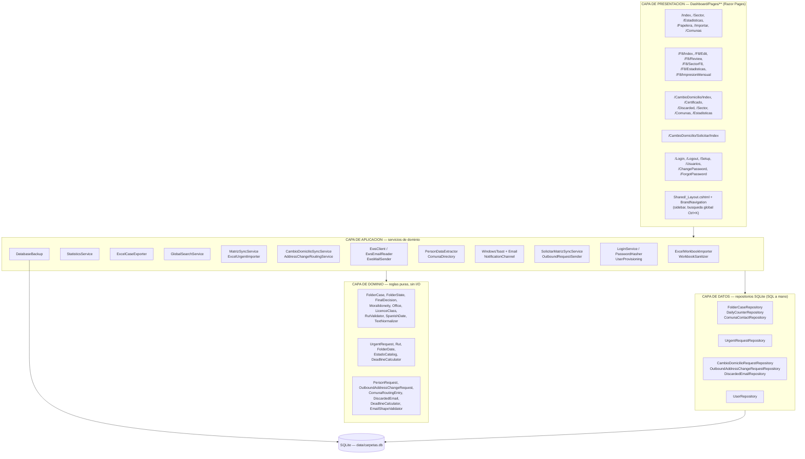

**Reglas de dependencia observadas:**

- Presentación → Aplicación → (Dominio + Datos). Sin saltos hacia atrás.
- El **Dominio no tiene I/O** (`RutValidator`, `TextNormalizer`, `DeadlineCalculator`,
  `PersonDataExtractor`, catálogos): son `static` o clases puras, altamente testeadas.
- **Duplicación deliberada entre módulos.** Existen tres `RutValidator`/`Rut`, dos
  `SpanishDate`, dos `DeadlineCalculator`, dos `FolderSector`. Cada módulo trae la suya para no
  acoplarse; los comentarios del código lo dicen explícitamente ("*Namespace-scoped separately …
  no class uses both*").
- **Puntos de contacto entre módulos:**
  - `AddressChangeRoutingService` (Cambio de Domicilio) inyecta `IUserRepository` (del módulo Auth) para el pie de firma del correo.
  - `ComunaDirectory` (Cambio de Domicilio) inyecta `IComunaContactRepository` (del núcleo) como fuente única del directorio de comunas.
  - `OutboundRequestSender` (Solicitadas) inyecta `IComunaContactRepository` (del núcleo).
  - `GlobalSearchService` (núcleo) consulta por SQL directo las tablas de **los cuatro** módulos.
  - Las estadísticas de Cambio de Domicilio reutilizan `FolderSector` y `DeadlineCalculator`.

---

## 7. Grafo de inyección de dependencias (contenedor DI)

Todo se registra en `Program.cs`. **Casi todo es `Singleton`** (la app es un proceso único de baja
concurrencia); la única excepción de negocio es `IEmailSender` (`Transient`).

### 7.1 Tabla de registros

| Servicio (interfaz → implementación) | Lifetime | Depende de | Consumido por |
| --- | --- | --- | --- |
| `CarpetasOptions` (instancia) | Singleton | — | Importador, backup, páginas núcleo |
| `F8Options` (instancia) | Singleton | — | Páginas F8 |
| `CambioDomicilioOptions` (instancia, rutas resueltas) | Singleton | — | Todo el módulo CD |
| `IOptions<SmtpOptions>` (bind) | Singleton | `Configuration` | `SmtpEmailSender` |
| `DatabaseBackup` (instancia) | Singleton | rutas + `BackupsToKeep` + `SecondaryBackupDirectory` | `Program.cs` (arranque), pantalla Usuarios |
| `IFolderCaseRepository` → `FolderCaseRepository` | Singleton | connection string | Importador, Stats, export, páginas Casos/Sector, `GlobalSearchService`, F8 (propaga estado) |
| `IDailyCounterRepository` → `DailyCounterRepository` | Singleton | connection string | Importador, `StatisticsService` |
| `IComunaContactRepository` → `ComunaContactRepository` | Singleton | connection string | Importador, `ComunaDirectory`, `OutboundRequestSender`, pantalla Comunas |
| `IUserRepository` → `UserRepository` | Singleton | connection string | `LoginService`, `UserProvisioning`, `AddressChangeRoutingService`, páginas Auth |
| `ILoginService` → `LoginService` | Singleton | `IUserRepository` | `/Login` |
| `UserProvisioning` | Singleton | `IUserRepository` | `/Setup`, `/Usuarios`, CLI `--add-user` |
| `IExcelWorkbookImporter` → `ExcelWorkbookImporter` | Singleton | `IFolderCaseRepository`, `IDailyCounterRepository`, `IComunaContactRepository` | `/Importar`, CLI `--import` |
| `IExcelCaseExporter` → `ExcelCaseExporter` | Singleton | — | `/Index` (botón Exportar) |
| `StatisticsService` | Singleton | `IFolderCaseRepository`, `IDailyCounterRepository` | `/Estadisticas` |
| `IGlobalSearchService` → `GlobalSearchService` | Singleton | connection string | endpoint `GET /api/global-search` |
| `IUrgentRequestRepository` → `UrgentRequestRepository` | Singleton | connection string | Todas las páginas F8, `MatrizSyncService`, `ExcelUrgentImporter` |
| `IEmailSender` → `SmtpEmailSender` | **Transient** | `IOptions<SmtpOptions>` | `/F8/Index` (correo certificado) |
| `ICambioDomicilioRequestRepository` → `CambioDomicilioRequestRepository` | Singleton | connection string | `AddressChangeRoutingService`, `CambioDomicilioSyncService`, páginas CD, Stats |
| `IOutboundAddressChangeRequestRepository` → `OutboundAddressChangeRequestRepository` | Singleton | connection string | `OutboundRequestSender`, `SolicitarMatrizSyncService`, `/Solicitar/Index` |
| `OutboundRequestSender` | Singleton | `IOutboundAddressChangeRequestRepository`, `IComunaContactRepository`, `IMailSender` | `/Solicitar/Index`, botón "Solicitar cambio" en `/Index` |
| `IDiscardedEmailRepository` → `DiscardedEmailRepository` | Singleton | connection string | `AddressChangeRoutingService`, `/CambioDomicilio/Discarded`, Stats |
| `IComunaDirectory` → `ComunaDirectory` | Singleton | `IComunaContactRepository` | `AddressChangeRoutingService`, pantalla Comunas CD |
| `IEwsClient` → `EwsClient` | Singleton (perezoso) | `CambioDomicilioOptions`, `ILogger` | `EwsEmailReader`, `EwsMailSender` |
| `EwsEmailReader` (clase) | Singleton | `IEwsClient`, `ILogger` | — |
| `IEmailReader` → `EwsEmailReader` (misma instancia) | Singleton | ↑ | `CambioDomicilioSyncService`, CLI `--test-ews` |
| `IEmailMover` → `EwsEmailReader` (misma instancia) | Singleton | ↑ | `AddressChangeRoutingService` |
| `IMailSender` → `EwsMailSender` | Singleton | `IEwsClient` | `AddressChangeRoutingService`, `OutboundRequestSender`, `/CambioDomicilio/Certificado` |
| `ICsvReportWriter` → `CsvReportWriter` | Singleton | — | `CambioDomicilioSyncService` |
| `INotificationChannel` → `WindowsToastNotificationChannel` | Singleton (colección) | `CambioDomicilioOptions`, `ILogger` | `AddressChangeRoutingService` (recorre `IEnumerable<INotificationChannel>`) |
| `INotificationChannel` → `EmailNotificationChannel` | Singleton (colección) | `IMailSender`, `CambioDomicilioOptions` | ídem |
| `AddressChangeRoutingService` | Singleton | 9 dependencias (ver abajo) | `CambioDomicilioSyncService`, páginas `/CambioDomicilio/*` |
| `CambioDomicilioSyncService` | Singleton | `AddressChangeRoutingService`, `IEmailReader`, `ICambioDomicilioRequestRepository`, `ICsvReportWriter`, `CambioDomicilioOptions`, `ILogger` | `/CambioDomicilio/Index` (botón "Sincronizar Ahora") |
| `CambioDomicilioStatisticsService` | Singleton | `CambioDomicilioOptions` | `/CambioDomicilio/Estadisticas` |
| DataProtection | — | filesystem `keys/` | cookie de auth |
| Authentication + Cookie | — | DataProtection | pipeline |
| Authorization (`CambioDomicilioAccess`, `F8Access`) | — | claims | `[Authorize(Policy=…)]` |
| RazorPages (root `/Dashboard/Pages`) | — | — | routing |

### 7.2 Detalle del servicio más conectado — `AddressChangeRoutingService`

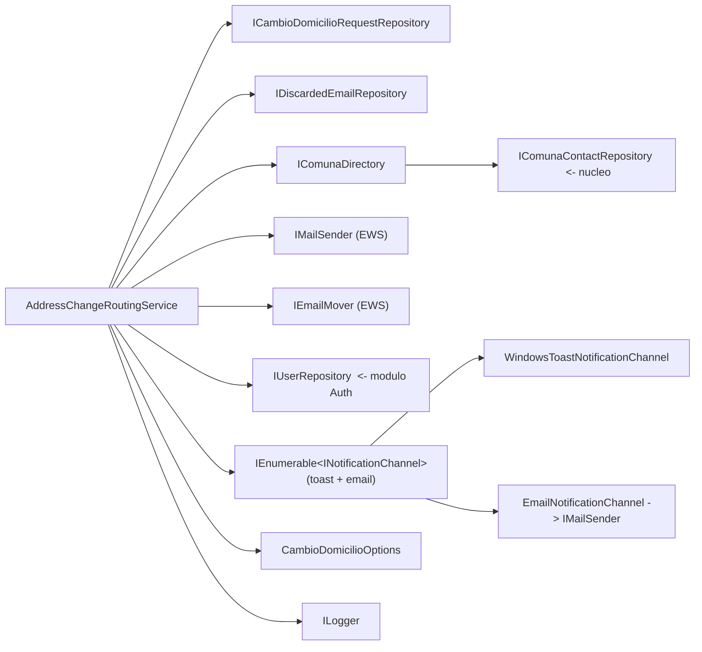

### 7.3 Pipeline de middleware y arranque

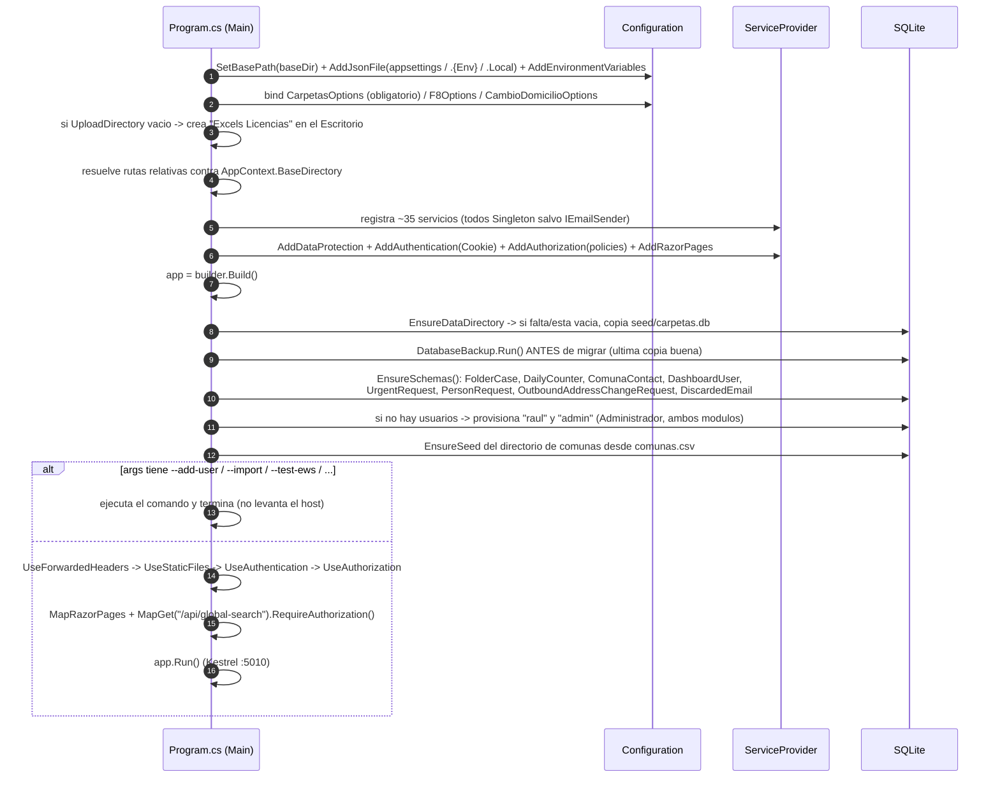

---

## 8. Módulo A — Gestión de Licencias (Casos)

**Propósito:** reemplazar las ~18 hojas de agenda (mes × oficina) del libro maestro. Cada fila es
un ciudadano citado en una fecha y oficina, con el estado de su carpeta física y la decisión final.

### 8.1 Componentes

| Componente | Archivo | Función |
| --- | --- | --- |
| `FolderCase` | `Domain/FolderCase.cs` | Entidad. Propiedades calculadas clave: `Sector` (Archivo si `LastFolderDate < 2023-07-01`, si no Oficina 43), `IsUploaded`, `AgingAlert` (SLA verde/amarillo/rojo), `FolderStateText`. |
| Catálogos | `Domain/FolderState.cs`, `FinalDecision.cs`, `MoralIdoneity.cs`, `Office.cs`, `LicenceClass.cs` | 14 estados de carpeta con sus 13 colores copiados del formato condicional del Excel; alias de escritura ("SE ENCUENTRA EN OF.43" ≡ "OF. 43"); estados "retirados" que siguen mostrándose pero no se pueden elegir. |
| `RutValidator` | `Domain/RutValidator.cs` | Normaliza a `13.025.150-1`, valida dígito verificador (módulo 11), rellena a 8 dígitos. RUT inválido → se conserva crudo y el caso queda `NeedsReview`. |
| `TextNormalizer` | `Domain/TextNormalizer.cs` | `Normalize` (mayúsculas + sin tildes + espacios colapsados) para *matching*; `DisplayUpper` (mayúsculas con tildes, `es-CL`) para pantalla; `NormalizeLoose` (solo alfanuméricos) para catálogos. |
| `ExcelWorkbookImporter` | `Import/ExcelWorkbookImporter.cs` | Orquesta la importación. **Clasifica cada hoja por sus encabezados, no por su nombre**: agenda (`FECHA DE LA CITACION`), citas (`FECHA CITA`), contadores (`ESCANEADAS` + `SUBIDAS`), directorio (`MUNICIPIO` + `CORREO`). |
| `WorkbookSanitizer` | `Import/WorkbookSanitizer.cs` | Copia temporal del `.xlsx` con los `dataValidation` eliminados (vía `ZipArchive`), porque las listas desplegables de las hojas PLANTILLA superan los 255 chars que acepta ClosedXML. |
| `AgendaRowMapper` / `CitasRowMapper` | `Import/*RowMapper.cs` | Fila cruda → `FolderCase`. Marca `NeedsReview` en vez de descartar. Regla del "mismo campo, dos significados": `FECHA ULTIMA CARPETA` con fecha → `LastFolderDate`; con texto → `LastFolderComuna`. |
| `CellValue` | `Import/CellValue.cs` | Convierte celda (fecha real / serial Excel / texto tipeado) a `DateOnly?` / `string?`. |
| `FolderCaseRepository` | `Persistence/FolderCaseRepository.cs` (1 294 líneas) | Repositorio principal. `UpsertMany` (una transacción por hoja; clave natural: oficina + fecha citación + RUT, o celda de origen). Consultas paginadas, filtros, orden con tildes (`FullNameSort`), hundimiento de lo ya subido. Tabla de auditoría `CaseAuditLog`. |
| `StatisticsService` | `Statistics/StatisticsService.cs` | Reconstruye la hoja "ESCANEADAS Y SUBIDAS": agendadas/atendidas/% se cuentan; escaneadas/subidas siguen siendo contadores manuales. `UserStatsForMonth` cruza `CaseAuditLog`. |
| `ExcelCaseExporter` | `Reporting/ExcelCaseExporter.cs` | Genera `.xlsx` con el mismo layout de columnas del libro maestro para la vista filtrada. |
| `DatabaseBackup` | `Persistence/DatabaseBackup.cs` | Copia la db en cada arranque **antes** de migrar; verifica con `PRAGMA integrity_check`; rota (`BackupsToKeep`, 10); copia opcional a directorio secundario/UNC. |
| Páginas | `Dashboard/Pages/Index.cshtml(.cs)` (638 líneas), `Sector`, `Estadisticas`, `Papelera`, `Importar`, `Comunas` | Edición en línea, alta manual, papelera con restauración, documento imprimible de sector, gráficos CSS puros sin librería. |

### 8.2 Flujo de datos del módulo

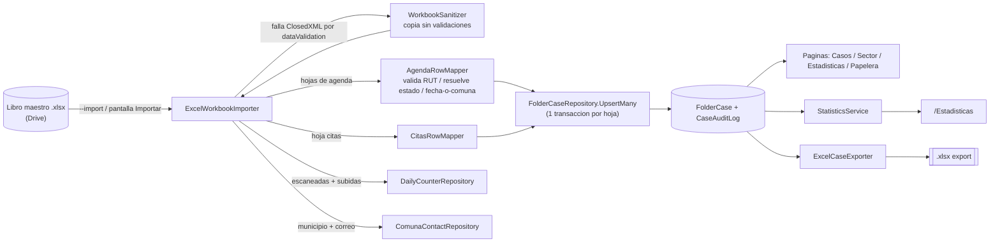

---

## 9. Módulo B — F8 Urgentes

**Propósito:** gestionar solicitudes urgentes de archivo cuando la carpeta física no aparece.
Vive en la misma `carpetas.db` (tabla propia `UrgentRequest`), detrás de la política `F8Access`
(claim `mod:f8-urgentes`).

### 9.1 Componentes

| Componente | Archivo | Función |
| --- | --- | --- |
| `UrgentRequest` | `F8/Domain/UrgentRequest.cs` | Entidad. `Sector` calculado desde `FechaPenultimaCarpeta`. `MatrizSector` (AV. ARGENTINA / PLACILLA / MERC. PUERTO) leído del nombre de hoja de la matriz. `PendienteEscrituraExcel` (cola de escritura de vuelta). |
| `Rut` / `RutFormatter` | `F8/Domain/Rut.cs` | Validación de RUT propia del módulo (no comparte con `Domain/RutValidator`). Forma canónica con cero a la izquierda. |
| `FolderDate` | `F8/Domain/FolderDate.cs` | Parseo de fecha ISO / serial Excel / texto, con resultado tri-estado (`Ok` / `OutOfRange` / `Unparseable`). |
| `EstadoCatalog` | `F8/Domain/EstadoCatalog.cs` | `ESTADO` / `ESTADO ACTUAL` como **strings canonicalizados abiertos**, no enum (los operadores inventan valores). Solo alimenta el desplegable y el *flag* "valor no conocido". |
| `DeadlineCalculator` | `F8/Domain/DeadlineCalculator.cs` | Días hábiles (Lun-Vie, sin feriados chilenos). |
| `HeaderCanonicalizer` | `F8/Import/HeaderCanonicalizer.cs` | Resuelve columnas por nombre de encabezado, nunca por posición. |
| `ExcelUrgentImporter` | `F8/Import/ExcelUrgentImporter.cs` | Importación **histórica de una sola vez** de "URGENTES DIARIOS.xlsx" (hojas MAYO/JUNIO/JULIO). Marca-no-descarta celdas dudosas → tabla `ImportFlag`. `HasCompletedImport` evita reimportar. |
| `MatrizSyncService` | `F8/Matriz/MatrizSyncService.cs` (492 líneas) | **Usa DocumentFormat.OpenXml SDK directo** (no ClosedXML). *Entrada*: lee filas "NO EXISTE CARPETA" y crea casos. *Salida*: escribe "SUBIDA CON F8" + fecha (hoy **`SalidaEnabled = false`**, la cola se acumula). Backup timestamped antes de guardar, reintentos ante bloqueo, re-localización por RUT si la fila se movió. |
| `UrgentRequestRepository` | `F8/Data/UrgentRequestRepository.cs` (509 líneas) | Tablas `UrgentRequest`, `ImportFlag` (FK CASCADE), `ImportRun`. `PRAGMA foreign_keys = ON`. |
| `SmtpEmailSender` | `F8/Services/SmtpEmailSender.cs` | `IEmailSender` sobre `System.Net.Mail`. Único consumidor de SMTP en todo el sistema. |
| Páginas | `Dashboard/Pages/F8/Index` (460 líneas), `Edit`, `Review`, `SectorF8`, `Estadisticas`, `ImpresionMensual` | Búsqueda, asignación, auditoría, recordatorio de impresión mensual, propagación de estado a `FolderCase` cuando hay equivalencia no ambigua. |

### 9.2 Flujo del módulo

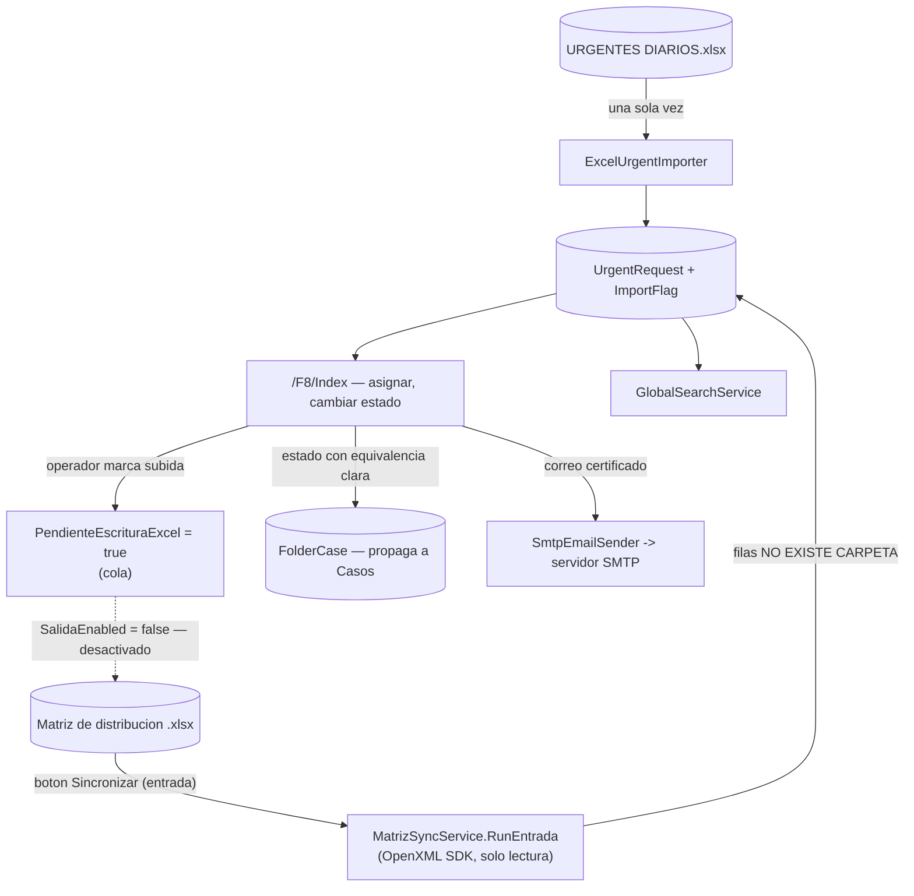

---

## 10. Módulo C — Cambio de Domicilio (Recibidas)

**Propósito:** cuando **otra comuna** le pide a Valparaíso la carpeta de un contribuyente por
correo, este módulo lee el buzón Exchange, registra el caso, y cuando el operador sube la carpeta a
Conaset y confirma, envía el correo de confirmación a la comuna. **No hay polling automático**: el
ciclo corre solo al presionar "Sincronizar Ahora".

### 10.1 Componentes

| Componente | Archivo | Función |
| --- | --- | --- |
| `PersonRequest` | `CambioDomicilio/Domain/PersonRequest.cs` | Entidad. Estados: `Pending → Uploaded → Confirmed`. `Sector` calculado desde `FechaUltimaCarpeta`. `Destination` (`None` / `F8` / `Certificado`) mueve el caso a una pantalla dedicada. |
| `ComunaRoutingEntry` | `CambioDomicilio/Domain/ComunaRoutingEntry.cs` | Fila del directorio de ruteo: `Comuna`, `ContactEmail`, `Domain`. |
| `PersonDataExtractor` | `CambioDomicilio/Extraction/PersonDataExtractor.cs` (264 líneas) | Extrae RUT + nombre del cuerpo/asunto. Calibrado contra 38 correos reales. 4 patrones de RUT en prioridad (prefijado / punteado / sin puntos / separado por espacios — el de Viña del Mar). El nombre se busca solo en la ventana de 90 chars adyacente al RUT. Del asunto **nunca** devuelve nombre (fraseo impredecible). Soporta varios contribuyentes por correo. |
| `RutValidator` (CD) | `CambioDomicilio/Extraction/RutValidator.cs` | Tercera copia del validador, propia del módulo. |
| `ComunaDirectory` | `CambioDomicilio/Directories/ComunaDirectory.cs` | `IComunaDirectory`. Lee `comunas.csv`. **El CSV es una proyección de solo lectura de la tabla `ComunaContact`** (`EnsureSeed` lo regenera si falta). `ResolveByDomain`: primero coincidencia exacta de dirección; *fallback* a dominio solo si **una sola** comuna lo posee (dominios compartidos tipo gmail → descarte para revisión). Escrituras atómicas (temp + `Move`). |
| `DeadlineCalculator` (CD) | `CambioDomicilio/Domain/DeadlineCalculator.cs` | Plazo legal `PlazoDiasHabiles` (15) en días hábiles desde la fecha de recepción del correo. |
| `AddressChangeRoutingService` | `CambioDomicilio/Routing/AddressChangeRoutingService.cs` (362 líneas) | **El corazón del módulo.** `ProcessIncomingRequest` (idempotente: message-id ya visto → nada; correo devuelto a la carpeta origen → revierte Uploaded→Pending; dominio propio → ignora; sin comuna → `DiscardedEmail`). `ProcessUploadedCase` (correo en "CARP. YA SUBIDAS" → marca Uploaded). `MarkUploadedAndConfirmAsync` (mueve el correo + confirma en un clic). `SendConfirmationAsync` / `RectifyConfirmationAsync` (correo de rectificación + revertir). |
| `CambioDomicilioSyncService` | `CambioDomicilio/Routing/CambioDomicilioSyncService.cs` | Ejecuta **un ciclo** bajo demanda. `SemaphoreSlim(1,1)` como *singleton* → un solo ciclo a la vez entre pestañas/operadores. Resultado tipado: `Completed` / `SkippedBusy` / `SkippedNoDirectory` / `Failed` con contadores (creados / descartados / para revisión). Escribe el CSV de reporte. |
| Cliente EWS | `CambioDomicilio/Ews/*` | Ver §5.1. |
| Notificaciones | `CambioDomicilio/Notifications/*` | `INotificationChannel` con dos implementaciones registradas como colección: `WindowsToastNotificationChannel` (PC del operador) y `EmailNotificationChannel` (fire-and-forget a `NotificationEmailAddress`, sirve en VPS headless). Ambas se disparan al confirmar. |
| `EmailTemplates` | `CambioDomicilio/Notifications/EmailTemplates.cs` | Cuerpos fijos: confirmación de subida, confirmación vía F8, rectificación, aviso de confirmación, solicitud de certificado a Secretaría Municipal, acuse a la comuna. |
| `CsvReportWriter` | `CambioDomicilio/Reporting/CsvReportWriter.cs` | Vuelca `PersonRequest[]` a `data/reports/cambio-domicilio.csv` (temp + `Move`). |
| `CambioDomicilioStatisticsService` | `CambioDomicilio/Statistics/CambioDomicilioStatisticsService.cs` | Agregaciones en memoria (LINQ) sobre `GetAll()`: conteos por estado, ingreso semanal, top comunas, motivos de descarte, *turnaround* promedio y su dispersión, distribución por sector, backlog F8 vs plazo, estado de certificados. |
| `CambioDomicilioRequestRepository` | `CambioDomicilio/Data/CambioDomicilioRequestRepository.cs` (604 líneas) | Tablas `PersonRequest`, `DeletedSourceMessage` (tumba de message-ids borrados a mano para que el ciclo no los recree). |
| `DiscardedEmailRepository` | `CambioDomicilio/Data/DiscardedEmailRepository.cs` | Tabla `DiscardedEmail` (correos sin comuna reconocible → pantalla `/CambioDomicilio/Discarded`). |
| Páginas | `Dashboard/Pages/CambioDomicilio/Index` (431 líneas), `Certificado`, `Discarded`, `Sector`, `Comunas`, `Estadisticas` | "Sincronizar Ahora", corrección manual de datos, alta manual, traspaso a F8/Certificado, un-clic de confirmación, deshacer con rectificación. |

### 10.2 Grafo de dependencias del módulo

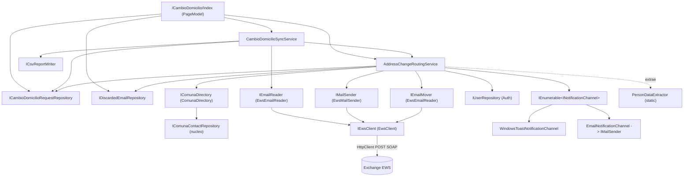

---

## 11. Módulo D — Cambio de Domicilio (Solicitadas)

**Propósito:** el sentido inverso. Cuando Valparaíso necesita pedirle a **otra comuna** la carpeta
de alguien que hizo cambio de domicilio, este módulo arma el correo (con cita legal del art. 14 del
Decreto 170 del MTT) y lo envía por EWS.

### 11.1 Componentes

| Componente | Archivo | Función |
| --- | --- | --- |
| `OutboundAddressChangeRequest` | `CambioDomicilio/Domain/OutboundAddressChangeRequest.cs` | Entidad. Estado `Borrador → Enviada`. `DestinationComuna`, `SourceFolderCaseId` (opcional, si nació del botón en `/Index` de Casos). |
| `OutboundRequestSender` | `CambioDomicilio/Solicitar/OutboundRequestSender.cs` | Lógica compartida de envío: busca contactos de la comuna (`IComunaContactRepository`), arma asunto/cuerpo, envía **un correo por dirección registrada** vía `IMailSender` (EWS), maneja el fallo (`InvalidOperationException` / `HttpRequestException` / `SocketException` / `TaskCanceledException` → queda `Borrador` para reintentar), `MarkSent`. Resultado tipado: `Sent` / `AlreadySent` / `NoContact` / `SendFailed`. |
| `SolicitarMatrizSyncService` | `CambioDomicilio/Solicitar/SolicitarMatrizSyncService.cs` | Botón "Sincronizar Ahora" alternativo: en vez de correo, lee un Excel configurable (`SolicitarMatrizExcelPath`, encabezados `RUT` / `NOMBRE` / `COMUNA`). Solo lectura. `SemaphoreSlim` estático anti doble-clic. Cada fila nueva → `Borrador`. Dedup por RUT normalizado. |
| `OutboundAddressChangeRequestRepository` | `CambioDomicilio/Data/OutboundAddressChangeRequestRepository.cs` (371 líneas) | Tablas `OutboundAddressChangeRequest`, `OutboundAddressChangeAttachment`. Migración *rebuild-and-swap* (Street/Number pasaron de NOT NULL a NULL). |
| Página | `Dashboard/Pages/CambioDomicilio/Solicitar/Index.cshtml(.cs)` (152 líneas) | Lista de solicitudes, "+ Nueva", "Sincronizar Ahora", enviar. También el botón "Solicitar cambio de domicilio" de la pantalla `/Index` (Casos) entra por acá. |

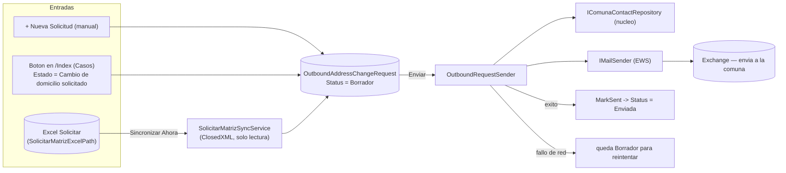

---

## 12. Módulo transversal — Autenticación y Dashboard

### 12.1 Componentes

| Componente | Archivo | Función |
| --- | --- | --- |
| `DashboardUser` | `Dashboard/Auth/DashboardUser.cs` | Entidad. `Role` (`Administrador` / `Jefatura` / `Coordinador` / `Administrativo`), `CanAccessCambioDomicilio` / `CanAccessF8Urgentes` (solo se consultan para `Administrativo`), `EmailFooter` (firma personal en correos CD), `FailedLoginAttempts` / `LockedUntil`. |
| `PasswordHasher` | `Dashboard/Auth/PasswordHasher.cs` | PBKDF2-SHA256, 210 000 iteraciones, sal aleatoria de 16 bytes por usuario, hash de 32 bytes, comparación en tiempo fijo. **Sin ASP.NET Identity** — "una tabla y dos funciones". |
| `LoginService` | `Dashboard/Auth/LoginService.cs` | Fricción anti fuerza bruta: `Task.Delay(1 s)` en cada fallo, bloqueo de 15 min tras 5 intentos, retardo también cuando el usuario no existe (para no filtrar su existencia por *timing*). |
| `UserProvisioning` | `Dashboard/Auth/UserProvisioning.cs` | **Único lugar** que crea cuentas / fija contraseñas (para que consola y dashboard no discrepen). Mínimo 8 chars. Usuario normalizado a minúsculas + trim. |
| `UserRepository` | `Dashboard/Auth/UserRepository.cs` (274 líneas) | Tabla `DashboardUser`. |
| `UserRole` / `UserRoleCatalog` | `Dashboard/Auth/UserRole.cs` | `HasFullModuleAccess(role) = role != Administrativo`. |
| `BrandNavigation` | `Dashboard/Pages/Shared/BrandNavigation.cs` | `readonly record struct`. Una sola fuente de verdad para el título de marca y qué entrada del sidebar se marca activa (antes eran dos `StartsWith` que se desincronizaban). Usa `StartsWithSegments`. |
| `_Layout.cshtml` | `Dashboard/Pages/Shared/_Layout.cshtml` | Shell: sidebar con módulos condicionados por rol/claim, buscador global (`Ctrl+K` → `fetch /api/global-search`), formateo de RUT al copiar al portapapeles. |

### 12.2 Flujo de login y autorización

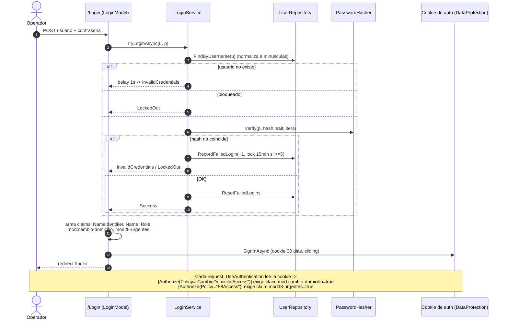

---

## 13. Esquema de base de datos

Todas las tablas viven en **un único archivo** `data/carpetas.db`. No hay claves foráneas entre
módulos (el acoplamiento es a nivel de aplicación); dentro de F8 sí hay FK con `CASCADE`.

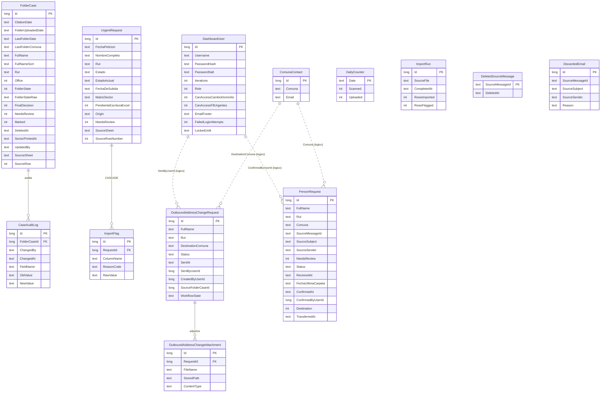

| Tabla | Módulo | Poblada por | Consumida por |
| --- | --- | --- | --- |
| `FolderCase` | Núcleo | Import Excel, alta manual, F8 (propaga estado) | Casos, Sector, Estadísticas, Papelera, búsqueda global |
| `CaseAuditLog` | Núcleo | Ediciones desde el dashboard | Estadísticas por usuario |
| `DailyCounter` | Núcleo | Import (hoja ESCANEADAS/SUBIDAS), edición manual | Estadísticas |
| `ComunaContact` | Núcleo | Import (hoja MUNICIPIO/CORREO), pantalla Comunas | `ComunaDirectory` (ruteo CD), `OutboundRequestSender` |
| `DashboardUser` | Auth | `UserProvisioning`, CLI | `LoginService`, pie de firma CD |
| `UrgentRequest` | F8 | `ExcelUrgentImporter`, `MatrizSyncService`, alta manual | Páginas F8, búsqueda global |
| `ImportFlag` | F8 | `ExcelUrgentImporter` | `/F8/Review` |
| `ImportRun` | F8 | `ExcelUrgentImporter` | Guarda contra reimportación |
| `PersonRequest` | CD Recibidas | `AddressChangeRoutingService` (ciclo EWS), alta manual | Páginas CD, Estadísticas CD, búsqueda global |
| `DeletedSourceMessage` | CD Recibidas | Borrado manual de un caso | Idempotencia del ciclo de sync |
| `DiscardedEmail` | CD Recibidas | Ciclo de sync (comuna no reconocida) | `/CambioDomicilio/Discarded`, Estadísticas |
| `OutboundAddressChangeRequest` | CD Solicitadas | Alta manual, botón en Casos, `SolicitarMatrizSyncService` | `/Solicitar`, `OutboundRequestSender`, búsqueda global |
| `OutboundAddressChangeAttachment` | CD Solicitadas | Carga de adjuntos | Envío |

---

## 14. Flujos paso a paso

### 14.1 Importación del libro maestro (`--import` o pantalla `/Importar`)

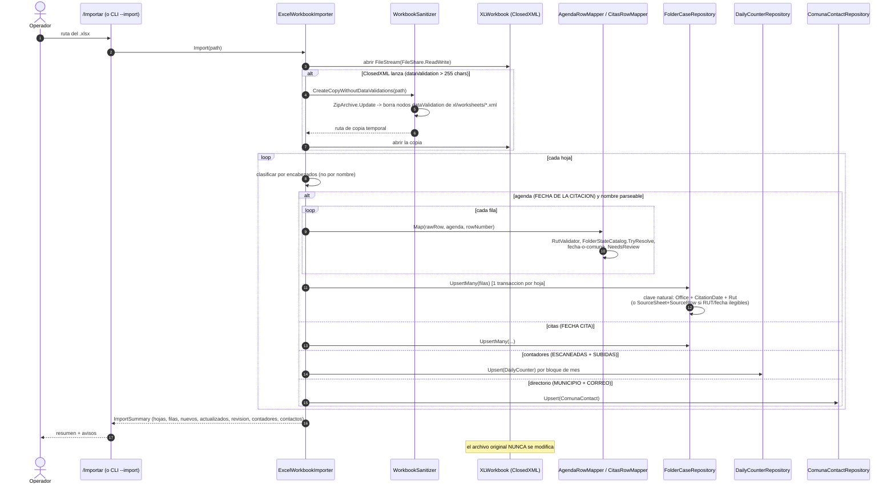

### 14.2 "Sincronizar Ahora" — Cambio de Domicilio Recibidas (ciclo EWS)

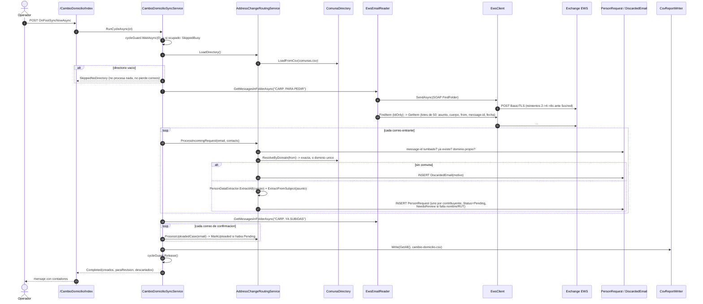

### 14.3 Confirmación de subida en un clic (envío EWS + notificaciones)

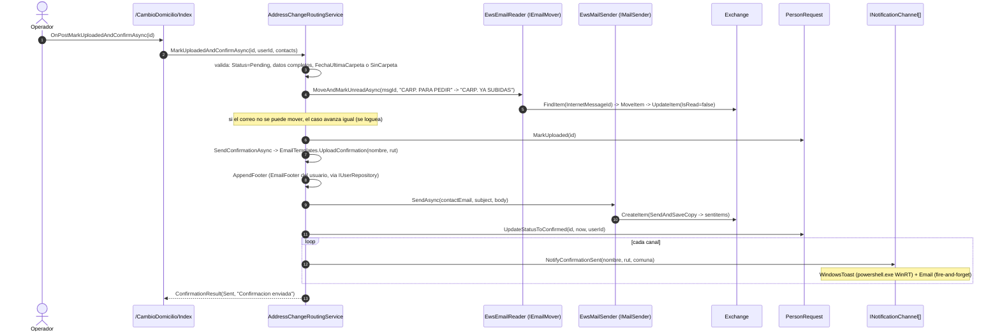

### 14.4 F8 — sincronización de la matriz (entrada)

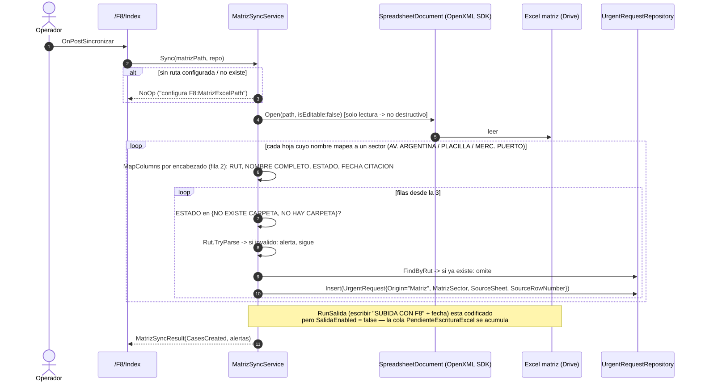

### 14.5 Arranque de la aplicación

Ver el diagrama de secuencia de §7.3.

---

## 15. Configuración

Fuentes, en orden de precedencia (la última gana):

1. `appsettings.json` (en git, valores base y no secretos)
2. `appsettings.{Environment}.json` (p. ej. `Development`, `Production`; `Development` **no** se copia al publicar)
3. `appsettings.Local.json` (**fuera de git**, junto al `.exe`; `dotnet publish` no lo sobrescribe — aquí van las credenciales EWS)
4. Variables de entorno (p. ej. `CambioDomicilio__Ews__Username`)

| Sección | Clave | Valor por defecto | Uso |
| --- | --- | --- | --- |
| `Kestrel` | `Endpoints:Http:Url` | `http://0.0.0.0:5010` | Binding único, sin HTTPS |
| `Carpetas` | `SqliteDbPath` | `data/carpetas.db` | Base de datos (anclada al exe) |
| `Carpetas` | `DefaultWorkbookPath` | `""` | Ruta precargada en `/Importar` |
| `Carpetas` | `UploadDirectory` | `""` → `Escritorio\Excels Licencias` | Dónde caen los libros subidos |
| `Carpetas` | `ExportDirectory` | `data/exports` | `.xlsx` generados |
| `Carpetas` | `PageSize` | `100` | Filas por página en Casos |
| `Carpetas` | `BackupsToKeep` | `10` | Rotación de copias |
| `Carpetas` | `SecondaryBackupDirectory` | `""` | Copia offsite/UNC opcional |
| `CambioDomicilio` | `Ews:Url` | `https://mail.munivalpo.cl/EWS/Exchange.asmx` | Endpoint EWS |
| `CambioDomicilio` | `Ews:Username` / `Ews:Password` | — (van en `.Local.json`) | Credenciales del buzón |
| `CambioDomicilio` | `MailboxAddress` | `cambiodedomicilio@munivalpo.cl` | Buzón compartido |
| `CambioDomicilio` | `OwnDomain` | `munivalpo.cl` | Descartar correspondencia interna |
| `CambioDomicilio` | `SourceFolderName` | `CARP. PARA PEDIR` | Carpeta Outlook de entrada |
| `CambioDomicilio` | `ConfirmationFolderName` | `CARP. YA SUBIDAS` | Carpeta Outlook de confirmación |
| `CambioDomicilio` | `PlazoDiasHabiles` | `15` | Plazo legal de subida |
| `CambioDomicilio` | `ComunaDirectoryCsvPath` | `data/comunas.csv` | Directorio de ruteo (proyección de `ComunaContact`) |
| `CambioDomicilio` | `SolicitarMatrizExcelPath` | `null` | Excel opcional para "Solicitar" |
| `CambioDomicilio` | `ReportCsvPath` | `data/reports/cambio-domicilio.csv` | CSV que escribe el ciclo |
| `CambioDomicilio` | `NotificationEmailAddress` | `""` | Aviso interno al confirmar (VPS) |
| `CambioDomicilio` | `CertificateRequestEmailAddress` | `javiera.sanchez@munivalpo.cl` | Destino de "solicitar certificado" |
| `CambioDomicilio` | `ToastNotificationsEnabled` | `true` | Toast en el PC del operador |
| `F8` | `MatrizExcelPath` | ruta a Drive en `appsettings.json` | Excel matriz de distribución |
| `F8` | `ExcelSourcePath` | `null` | Histórico "URGENTES DIARIOS" |
| `Smtp` | `Host` / `Port` / `EnableSsl` / `Username` / `Password` / `FromAddress` / `FromDisplayName` | Port 587, SSL on | Correo F8 (sin validación al arranque) |

---

## 16. Despliegue

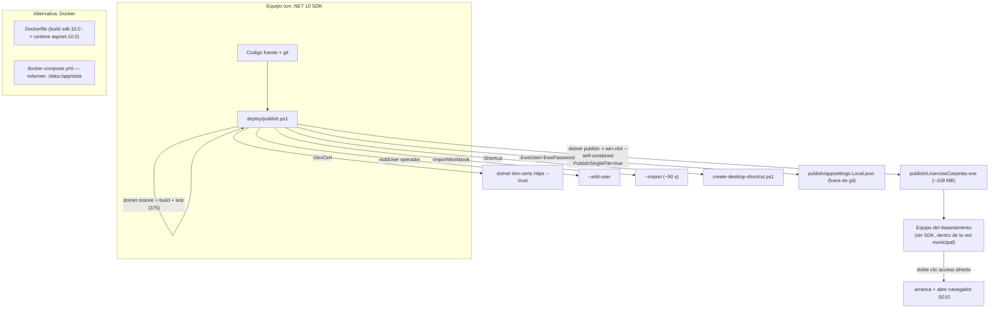

- **On-premise, sin nube.** El `KeepAlive` de Render fue eliminado (commit `aaf370e`). Necesita
  estar dentro de la red municipal para llegar al buzón Exchange.
- **Sin Tarea Programada.** A diferencia de `outlook-comuna-router`, no corre en segundo plano; se
  abre cuando el operador la necesita.
- **La base sobrevive a la republicación:** `publish/data/carpetas.db` no se toca en `git pull` +
  `publish.ps1`.
- **CI:** `.github/workflows/ci.yml` existe pero **hoy no ejecuta** (`startup_failure` a los 0 s —
  causa apuntada a la facturación de Actions de la cuenta). Verificación real: `dotnet test` local.

---

## 17. Pruebas

- **Proyecto:** `tests/LicenciasCarpetas.Tests` (xUnit).
- **Volumen actual:** ~375 `[Fact]`/`[Theory]` en 65 archivos (el README menciona 267 y el
  `deploy/README.md` 89 — cifras desactualizadas).
- **Cobertura por área** (según estructura de carpetas de tests):
  `CambioDomicilio/` (Data, Directories, Domain, Ews, Extraction, Reporting, Routing, Solicitar),
  `F8/`, más raíz: catálogos, validación de RUT, lectura de celdas, mapeo, deduplicación,
  detección de hojas, filtros, orden (tildes + hundimiento), paginación, papelera, asistencia,
  clases de licencia, colores por estado, RUT repetidos, informes de sector, estadísticas, saneado
  del libro, export completo, autenticación (bloqueo, mayúsculas, reset) y respaldos.
- **Pruebas de integración de páginas:** vía `Microsoft.AspNetCore.Mvc.Testing` +
  `public partial class Program`.

---

## 18. Matriz de interconexión entre componentes

Filas = componente que **usa**; columnas = componente **usado**. `E` = dependencia externa.

| ↓ usa / usó → | SQLite | ClosedXML | OpenXML SDK | EWS (HttpClient) | SMTP | DataProtection | Windows/Process | ComunaContact repo | UserRepo |
| --- | :---: | :---: | :---: | :---: | :---: | :---: | :---: | :---: | :---: |
| `ExcelWorkbookImporter` | ✅ (3 repos) | ✅ | — | — | — | — | — | ✅ | — |
| `WorkbookSanitizer` | — | — | — (usa `ZipArchive`) | — | — | — | — | — | — |
| `StatisticsService` | ✅ | — | — | — | — | — | — | — | — |
| `ExcelCaseExporter` | — | ✅ | — | — | — | — | — | — | — |
| `GlobalSearchService` | ✅ (4 tablas) | — | — | — | — | — | — | — | — |
| `DatabaseBackup` | ✅ (integrity_check) | — | — | — | — | — | — | — | — |
| `ExcelUrgentImporter` (F8) | ✅ | ✅ | — | — | — | — | — | — | — |
| `MatrizSyncService` (F8) | ✅ | — | ✅ | — | — | — | — | — | — |
| `SmtpEmailSender` (F8) | — | — | — | — | ✅ | — | — | — | — |
| `EwsClient` | — | — | — | ✅ | — | — | — | — | — |
| `EwsEmailReader` / `EwsMailSender` | — | — | — | ✅ (vía `IEwsClient`) | — | — | — | — | — |
| `AddressChangeRoutingService` | ✅ (3 repos) | — | — | ✅ (send + move) | — | — | — | ✅ (vía `ComunaDirectory`) | ✅ (footer) |
| `CambioDomicilioSyncService` | ✅ | — | — | ✅ (read) | — | — | — | ✅ | — |
| `ComunaDirectory` | — | — | — | — | — | — | — | ✅ | — |
| `WindowsToastNotificationChannel` | — | — | — | — | — | — | ✅ (`powershell.exe`) | — | — |
| `EmailNotificationChannel` | — | — | — | ✅ (vía `IMailSender`) | — | — | — | — | — |
| `SolicitarMatrizSyncService` | ✅ | ✅ | — | — | — | — | — | — | — |
| `OutboundRequestSender` | ✅ | — | — | ✅ (send) | — | — | — | ✅ | — |
| `LoginService` / `UserProvisioning` | ✅ (vía `UserRepository`) | — | — | — | — | — | — | — | ✅ |
| Pipeline (cookie de auth) | — | — | — | — | — | ✅ | — | — | — |
| `Program.cs` (`--open-browser`) | — | — | — | — | — | — | ✅ (navegador) | — | — |

---

## 19. Observaciones y riesgos técnicos

| # | Observación | Impacto | Comentario |
| --- | --- | --- | --- |
| 1 | **Superficie de dependencias mínima** (3 NuGet directas). | Positivo. | Menos CVEs que seguir, publish self-contained predecible. |
| 2 | Conflicto de versión `SQLitePCLRaw.core` (2.1.11 pedida vs 3.0.3 forzada). | Bajo. | Resuelve a 3.0.3 y funciona; vigilar al subir `Microsoft.Data.Sqlite`. |
| 3 | SQLite **sin `journal_mode=WAL`** ni `busy_timeout` explícitos. | Bajo hoy. | La concurrencia se contiene con proceso único + `SemaphoreSlim`. Si algún día hay dos operadores escribiendo intensamente en paralelo, un `SQLITE_BUSY` es posible. |
| 4 | **Dos transportes de correo** distintos (EWS para CD, SMTP para F8) para el mismo tipo de mensaje "solicitar certificado". | Mantenibilidad. | Duplica configuración y modos de fallo. Unificar en EWS eliminaría la sección `Smtp` entera. |
| 5 | `EwsClient` crea su propio `HttpClient` en el constructor y lo mantiene vivo como singleton. | Bajo. | Es singleton, así que no hay *socket exhaustion*; pero no usa `IHttpClientFactory`, así que no hay rotación de DNS. Para un endpoint on-premise fijo es aceptable. |
| 6 | Credenciales EWS/SMTP en texto plano en `appsettings.Local.json` / variables de entorno; RUT y nombres **sin cifrar** en SQLite. | Depende del equipo. | Documentado: la protección es el cifrado de disco del equipo. El archivo `.Local.json` está fuera de git. |
| 7 | `MatrizSyncService.SalidaEnabled = false`: la escritura de vuelta al Excel está desactivada y la cola `PendienteEscrituraExcel` se acumula indefinidamente. | Funcional conocido. | Deliberado ("la oficina lo hace a mano por ahora"). Nada se pierde; al reactivar, se drena. |
| 8 | `EmailNotificationChannel` y `WindowsToastNotificationChannel` son **fire-and-forget**; un fallo no se propaga. | Aceptable. | Diseñado así: la notificación nunca debe bloquear ni tumbar el ciclo. |
| 9 | `PersonDataExtractor` calibrado contra 38 correos reales de 2026-07-03. | Riesgo de deriva. | Si una comuna cambia su plantilla de correo, ese caso caerá a `NeedsReview` (no se pierde, pero exige trabajo manual). Los patrones están aislados y testeados. |
| 10 | **Triple duplicación** de validación de RUT (`Domain/RutValidator`, `F8/Domain/Rut`, `CambioDomicilio/Extraction/RutValidator`) y doble de `SpanishDate`, `DeadlineCalculator`, `FolderSector`. | Mantenibilidad. | Decisión explícita de desacople entre módulos. Un cambio de regla de RUT hay que replicarlo en 3 sitios. |
| 11 | `GlobalSearchService` conoce por SQL crudo los nombres de columna de las 4 tablas de los 4 módulos (`try/catch` silencioso si la tabla no existe). | Acoplamiento oculto. | Renombrar una columna rompe la búsqueda global sin error de compilación. |
| 12 | CI de GitHub Actions no ejecuta (`startup_failure`). | Proceso. | Causa externa (facturación). Verificación real es `dotnet test` local antes de publicar. |
| 13 | `Program.cs` provisiona automáticamente `raul` / `admin` con contraseña `Valparaiso2025!` si la base no tiene usuarios. | Seguridad. | Cómodo para instalar; conviene forzar cambio de contraseña en el primer login o documentar el borrado del usuario `admin`. |
| 14 | El módulo F8 y el núcleo comparten `FolderCase`: F8 **propaga estado** a `FolderCase` cuando hay equivalencia no ambigua. | Interconexión. | Bien acotado (diccionario explícito `EstadoToFolderState`, sin adivinar), pero es el único punto donde un módulo escribe la entidad de otro. |

---

### Anexo — Inventario rápido de archivos por módulo

```text
src/LicenciasCarpetas/
- Program.cs .................... arranque, DI, pipeline, CLI
- Configuration/CarpetasOptions.cs
- Domain/ ...................... FolderCase, FolderState, FinalDecision, MoralIdoneity,
                                 Office, LicenceClass, RutValidator, SpanishDate,
                                 TextNormalizer, CaseAuditEntry, ComunaContact, DailyCounter
- Import/ ..................... ExcelWorkbookImporter, WorkbookSanitizer, AgendaRowMapper,
                                CitasRowMapper, AgendaSheet, CellValue, ImportSummary
- Persistence/ ............... FolderCaseRepository, DailyCounterRepository,
                               ComunaContactRepository, DatabaseBackup, GlobalSearchService,
                               CaseFilter
- Statistics/StatisticsService.cs, UserStatistics.cs
- Reporting/ExcelCaseExporter.cs
- F8/
  - F8Options.cs
  - Domain/ ................ UrgentRequest, Rut, RutFormatter, FolderDate, EstadoCatalog,
                             DeadlineCalculator, FolderSector, ImportFlag, SpanishDateFormatter
  - Import/ ................ ExcelUrgentImporter, HeaderCanonicalizer, ImportResult
  - Matriz/MatrizSyncService.cs, MatrizSyncResult.cs
  - Data/UrgentRequestRepository.cs (+ IUrgentRequestRepository)
  - Services/SmtpEmailSender.cs, SmtpOptions.cs, IEmailSender.cs, EmailAttachment.cs
- CambioDomicilio/
  - CambioDomicilioOptions.cs, CambioDomicilioPathResolver.cs
  - Domain/ ................ PersonRequest, OutboundAddressChangeRequest, ComunaRoutingEntry,
                             DiscardedEmail, DeadlineCalculator, EmailShapeValidator, SpanishDate
  - Extraction/PersonDataExtractor.cs, RutValidator.cs
  - Directories/ComunaDirectory.cs
  - Ews/ ................... EwsClient, EwsEmailReader, EwsMailSender, EwsMessages,
                             EwsResponseParser, EwsFolderRef, IEmailReader, IMailSender
  - Routing/AddressChangeRoutingService.cs, CambioDomicilioSyncService.cs
  - Solicitar/OutboundRequestSender.cs, SolicitarMatrizSyncService.cs
  - Notifications/ ......... INotificationChannel, WindowsToastNotificationChannel,
                             EmailNotificationChannel, EmailTemplates
  - Reporting/CsvReportWriter.cs
  - Statistics/CambioDomicilioStatisticsService.cs
  - Data/CambioDomicilioRequestRepository.cs, OutboundAddressChangeRequestRepository.cs,
         DiscardedEmailRepository.cs
- Dashboard/
  - Auth/ ................. DashboardUser, UserRole, PasswordHasher, LoginService,
                            UserProvisioning, UserRepository
  - Pages/ ................ Index, Sector, Estadisticas, Papelera, Importar, Comunas,
                            Login, Logout, Setup, Usuarios, ChangePassword, ForgotPassword,
                            Inicio, F8/*, CambioDomicilio/*, CambioDomicilio/Solicitar/*,
                            Shared/_Layout, Shared/BrandNavigation, Shared/_EstadisticasTabs
```
