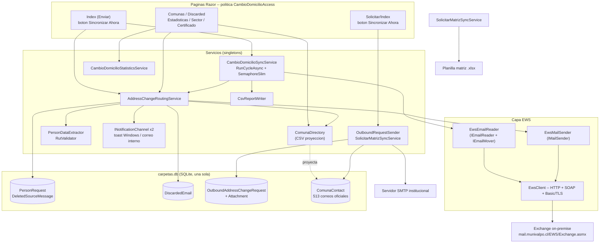
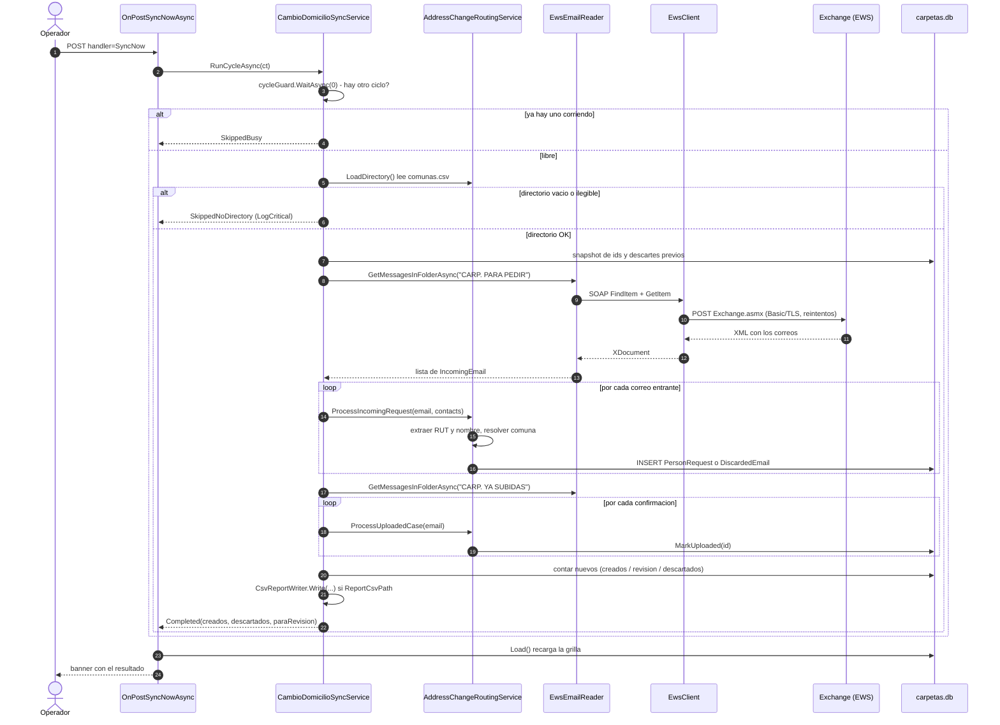
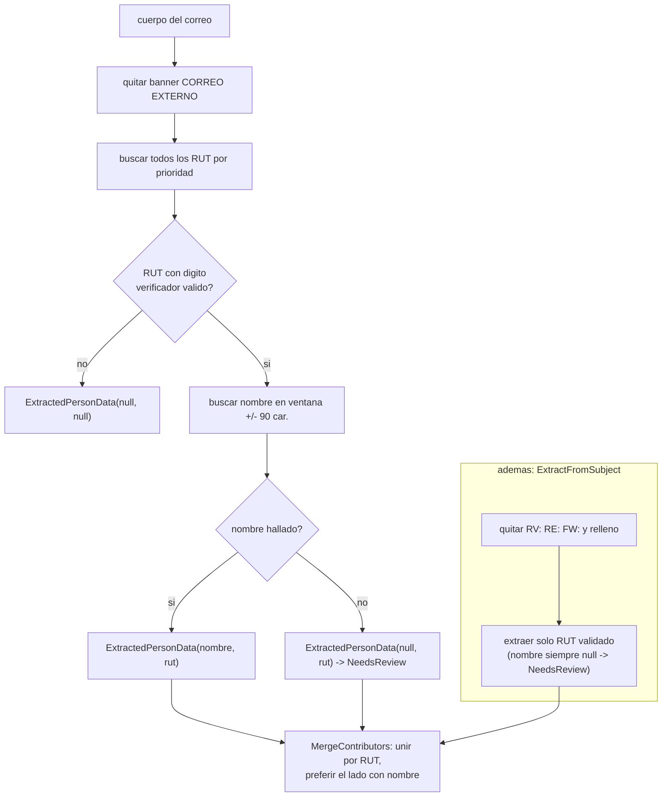
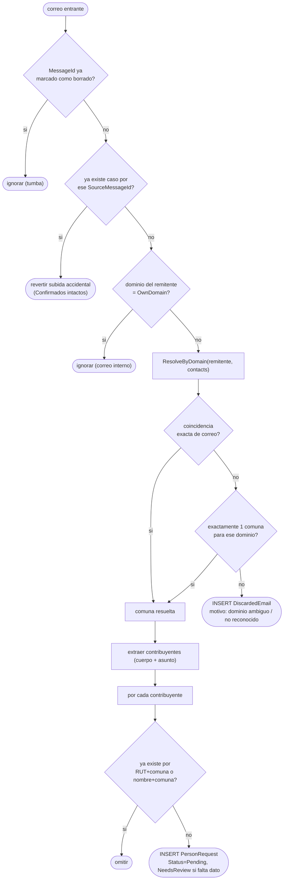
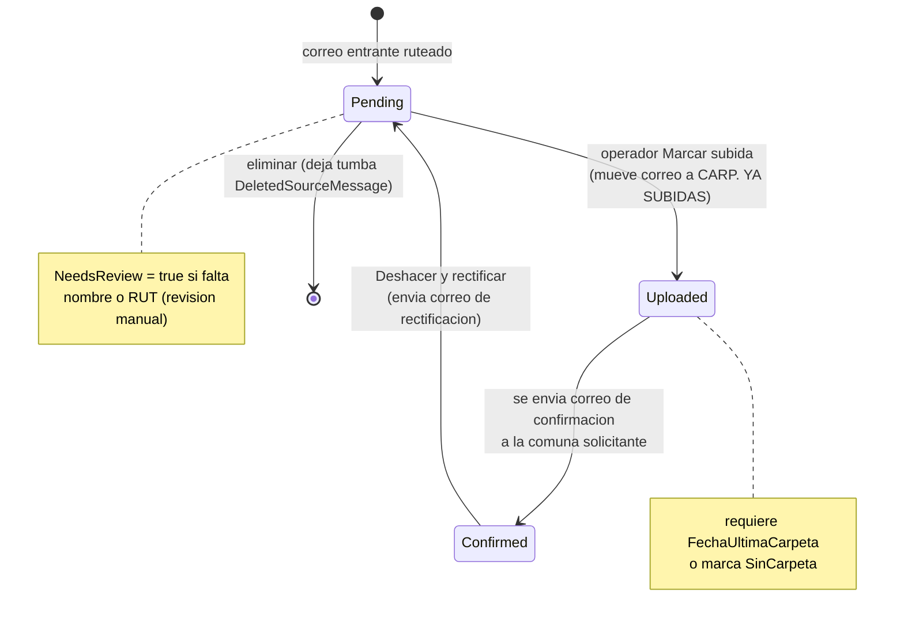
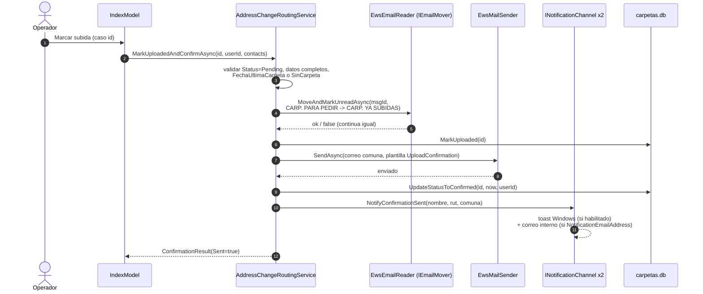
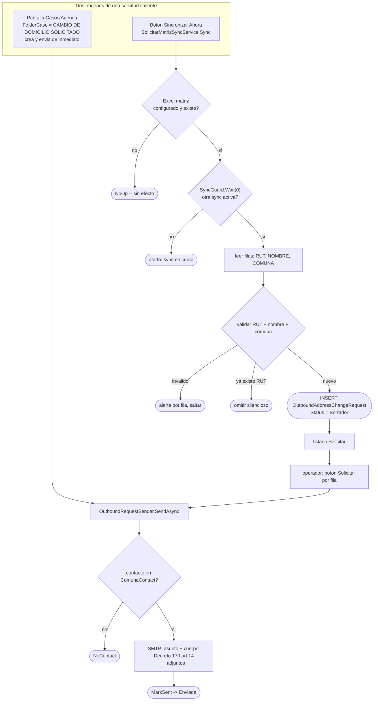
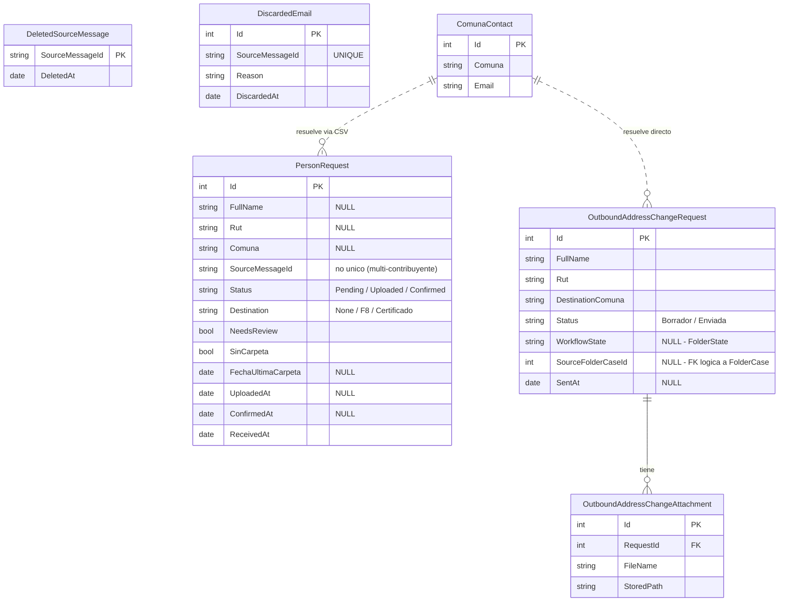

# Módulo Cambio de Domicilio — Informe Técnico

**Municipalidad de Valparaíso · Depto. Licencias de Conducir**
**Fecha:** 31 de agosto de 2026 · **Ámbito:** `src/LicenciasCarpetas/CambioDomicilio/**`
**Estado:** integrado · 520/520 pruebas · build limpio

> Versión imprimible (a PDF): abrir `docs/cambio-domicilio-informe.html` en el navegador → Imprimir → Guardar como PDF.
> Los diagramas de este archivo son Mermaid y se renderizan en GitHub y en la vista previa de VS Code.

---

## 1. Resumen ejecutivo

El módulo automatiza el trámite de **cambio de domicilio** de licencias de conducir: cuando una
persona cambia de comuna, su carpeta física debe viajar entre municipios. Antes vivía en una
aplicación separada (`outlook-comuna-router`) con su propio login y base de datos. Ahora está
plegado dentro de LicenciasCarpetas: un proceso, un login, una base `carpetas.db`.

| | |
|---|---|
| **Disparador** | Manual. El operador presiona **Sincronizar Ahora**. No hay proceso en segundo plano ni sondeo automático del buzón — decisión de diseño explícita. |
| **Entrada** | Correos en dos carpetas de Outlook del buzón `cambiodedomicilio@munivalpo.cl`, leídos por EWS (Exchange Web Services). |
| **Salida** | Casos en pantalla, correos de confirmación a la comuna solicitante, un CSV de reporte por ciclo, avisos (toast Windows / correo interno). |
| **Dos direcciones** | **Entrante** (otra comuna nos pide una carpeta) y **Saliente** / «Solicitar» (nosotros pedimos una carpeta a otra comuna). Botones y motores distintos. |
| **Estado del botón** | El cableado entrante está **completo en código**. Solo falta cargar usuario y clave del buzón (ver §5). |

---

## 2. Qué resuelve y los dos flujos

El trámite legal es el traspaso de la carpeta de licencia entre municipios cuando cambia el
domicilio del titular (Decreto 170, art. 14).

- **Flujo entrante — «Enviar Cambio de Domicilio».** Otra comuna nos escribe pidiendo la carpeta de
  un contribuyente que se mudó a su territorio. El sistema lee el correo, extrae nombre y RUT,
  identifica la comuna por el remitente, crea un *caso* y — una vez que el operador sube la carpeta a
  Conaset — envía el correo de confirmación de vuelta.
- **Flujo saliente — «Solicitar Cambios de Domicilio».** Un contribuyente llega a Valparaíso desde
  otra comuna. Necesitamos su carpeta, así que enviamos el correo de solicitud a esa comuna. La
  fuente aquí no es un buzón sino una planilla Excel matriz; el envío es por SMTP, no EWS.

| Dimensión | Entrante (Enviar) | Saliente (Solicitar) |
|---|---|---|
| Página | `/CambioDomicilio/Index` | `/CambioDomicilio/Solicitar/Index` |
| «Sincronizar Ahora» llama a | `CambioDomicilioSyncService.RunCycleAsync` | `SolicitarMatrizSyncService.Sync` |
| Fuente de datos | Buzón Exchange (carpetas de Outlook) | Planilla Excel (`SolicitarMatrizExcelPath`) |
| Transporte de correo | EWS (`EwsMailSender`) | SMTP (`SmtpEmailSender`, reusado de F8) |
| Directorio de comunas | CSV `comunas.csv` (proyección) | Tabla `ComunaContact` directa |
| Tabla destino | `PersonRequest` | `OutboundAddressChangeRequest` |

---

## 3. Arquitectura y dependencias

Todo el módulo se registra como *singletons* en `Program.cs`. No hay `BackgroundService`. Las
páginas Razor son transitorias pero comparten los servicios y, por tanto, el semáforo
anti-solapamiento.


*Diagrama 1. Componentes y dependencias. Línea punteada = proyección de solo lectura desde la tabla
`ComunaContact` hacia el CSV; el módulo de ruteo nunca escribe esa tabla.*

Registro en `Program.cs` (resumido):

```csharp
builder.Services.AddSingleton(cambioDomicilioOptions);               // options concreto, no IOptions<T>
builder.Services.AddSingleton<ICambioDomicilioRequestRepository>(_ => new CambioDomicilioRequestRepository(connectionString));
builder.Services.AddSingleton<IOutboundAddressChangeRequestRepository>(_ => new OutboundAddressChangeRequestRepository(connectionString));
builder.Services.AddSingleton<IDiscardedEmailRepository>(_ => new DiscardedEmailRepository(connectionString));
builder.Services.AddSingleton<IComunaDirectory>(sp => new ComunaDirectory(sp.GetRequiredService<IComunaContactRepository>()));
builder.Services.AddSingleton<IEwsClient, EwsClient>();
builder.Services.AddSingleton<EwsEmailReader>();
builder.Services.AddSingleton<IEmailReader>(sp => sp.GetRequiredService<EwsEmailReader>());
builder.Services.AddSingleton<IEmailMover>(sp => sp.GetRequiredService<EwsEmailReader>());
builder.Services.AddSingleton<IMailSender, EwsMailSender>();
builder.Services.AddSingleton<ICsvReportWriter, CsvReportWriter>();
builder.Services.AddSingleton<INotificationChannel, WindowsToastNotificationChannel>();
builder.Services.AddSingleton<INotificationChannel, EmailNotificationChannel>();
builder.Services.AddSingleton<AddressChangeRoutingService>();
builder.Services.AddSingleton<CambioDomicilioSyncService>();
builder.Services.AddSingleton<CambioDomicilioStatisticsService>();
```

El mismo `EwsEmailReader` sirve como `IEmailReader` y `IEmailMover`. No hay implementación falsa o
nula en producción: los *fakes* viven solo en el proyecto de pruebas.

---

## 4. El botón «Sincronizar Ahora»

En `/CambioDomicilio/Index` el botón es un `<form method="post" asp-page-handler="SyncNow">`. Al
enviarse ejecuta `OnPostSyncNowAsync`, que hace exactamente una cosa:
`await routerWorker.RunCycleAsync(HttpContext.RequestAborted)` y traduce el resultado a un mensaje.


*Diagrama 2. Secuencia completa de un ciclo entrante. El semáforo `cycleGuard` usa espera de tiempo
cero: si otro ciclo corre, devuelve `SkippedBusy` sin bloquear.*

**Los cuatro resultados:**

| Resultado | Cuándo | Mensaje al operador |
|---|---|---|
| `Completed` | El ciclo terminó (aunque procese cero correos) | «Sincronización completada: N caso(s) creado(s), M para revisión, K correo(s) descartado(s).» |
| `SkippedBusy` | Ya había un ciclo en ejecución | «Ya hay una sincronización en curso, intente en unos segundos.» |
| `SkippedNoDirectory` | El CSV de comunas está vacío o ilegible | «No se pudo leer el directorio de comunas… No se procesó ningún correo.» |
| `Failed` | Excepción fuera del bucle: EWS caído, credenciales malas, fallo de base | «No se pudo completar la sincronización. Revise que las credenciales del correo institucional estén configuradas (CambioDomicilio:Ews)…» |

Una excepción al procesar *un* correo individual se registra y el lote continúa — no aborta el ciclo
ni produce `Failed`. La recarga automática de la página cada 120 s **solo re-renderiza**; no dispara
sincronización.

---

## 5. Conexión al correo institucional (EWS)

El botón ya está conectado en código a Exchange Web Services. El transporte, los reintentos y el
parseo SOAP están implementados y probados. Falta solo **cargar el usuario y la clave** del buzón.

| | |
|---|---|
| **Endpoint** | `https://mail.munivalpo.cl/EWS/Exchange.asmx` — ya en `appsettings.json`, clave `CambioDomicilio:Ews:Url`. |
| **Autenticación** | Basic sobre TLS. `Authorization: Basic base64("usuario:clave")` armado en `EwsClient`. Basic sobre NTLM por determinismo multiplataforma. |
| **Buzón** | `cambiodedomicilio@munivalpo.cl` (compartido). EWS opera sobre el buzón que autentican las credenciales. |
| **Transporte** | `HttpClient` timeout 100 s. Reintenta ante `408, 429, 500, 502, 503, 504` y `HttpRequestException`, hasta 4 intentos con retroceso exponencial desde 2 s. |
| **Protocolo** | `Exchange2013_SP1`. Valores inyectados como nodos XML (escape estructural). |
| **Validación** | Perezosa. `EwsClient` es singleton y nadie lo resuelve al arranque: un `CambioDomicilio:Ews` mal configurado **no impide iniciar la app**; el error aparece al presionar el botón (`Failed`). |

**Carpetas de Outlook:**

| Rol | Clave | Por defecto |
|---|---|---|
| Lee solicitudes entrantes | `CambioDomicilio:SourceFolderName` | `CARP. PARA PEDIR` |
| Lee confirmaciones de subida | `CambioDomicilio:ConfirmationFolderName` | `CARP. YA SUBIDAS` |

Al confirmar una subida con «Marcar subida», el correo original se **mueve** de la primera carpeta a
la segunda y se marca no leído. Deben existir con ese nombre exacto; si se renombran, actualizar la
config (el lector se auto-repara una vez, pero no adivina un nombre nuevo).

### Lo que falta y cómo cargarlo

`CambioDomicilio:Ews:Username` y `CambioDomicilio:Ews:Password` **no están en `appsettings.json` a
propósito**: son secretos y no viajan en git. Sin ellos, cada SOAP recibe 401 y el botón muestra
`Failed`.

Van en `appsettings.Local.json`, **junto al `.exe`**. Está fuera de git y `dotnet publish` **no lo
sobrescribe**: sobrevive a cada `git pull` + republicación. Plantilla versionada:
`src/LicenciasCarpetas/appsettings.Local.Example.json`.

```powershell
# Opcion A -- al publicar, pasando las credenciales:
.\deploy\publish.ps1 -EwsUser "cambiodedomicilio@munivalpo.cl" -EwsPassword "LA-CLAVE"

# Opcion B -- a mano:
copy src\LicenciasCarpetas\appsettings.Local.Example.json publish\appsettings.Local.json
notepad publish\appsettings.Local.json

# Opcion C -- sin archivo, variables de entorno de la maquina:
setx CambioDomicilio__Ews__Username "cambiodedomicilio@munivalpo.cl"
setx CambioDomicilio__Ews__Password "LA-CLAVE"
```

Contenido de `appsettings.Local.json`:

```json
{
  "CambioDomicilio": {
    "Ews": {
      "Url": "https://mail.munivalpo.cl/EWS/Exchange.asmx",
      "Username": "cambiodedomicilio@munivalpo.cl",
      "Password": "LA-CLAVE-DEL-BUZON"
    }
  }
}
```

### Prueba de humo

1. Cargar las credenciales (A, B o C).
2. Entrar al dashboard con un usuario que tenga el módulo → **Enviar Cambio de Domicilio**.
3. Presionar **Sincronizar Ahora**.
4. **Éxito:** banner verde «Sincronización completada…». Los correos en `CARP. PARA PEDIR` aparecen como casos.
5. **401 / credenciales:** banner rojo `Failed` con la mención a `CambioDomicilio:Ews`. Revisar usuario/clave y que el buzón permita EWS.
6. **Carpeta inexistente:** el ciclo igual completa; queda un *warning* en el log y devuelve lista vacía.

---

## 6. Extracción de nombre y RUT

`PersonDataExtractor` fue calibrado contra 38 correos reales de producción. Del lado entrante solo
saca **RUT** y **nombre completo**.

Orden de prioridad para el RUT:

1. Con prefijo: `RUT:` / `R.U.T.` / `RUN`, puntos opcionales.
2. Con puntos y guion: `12.345.678-9`.
3. Sin puntos: `12345678-9`.
4. Separado por espacios (export de Viña del Mar): cuerpo y dígito verificador con 1–10 espacios.

Cada candidato se valida con el dígito verificador (módulo 11) en `RutValidator`. El primero válido
gana. El nombre se busca en una ventana de ±90 caracteres alrededor del RUT: se prefiere la última
secuencia de 2–5 palabras capitalizadas *antes* del RUT, si no la primera *después*. Palabras de
borde (`DON`, `DOÑA`, `SR`, `CÉDULA`…) se recortan.


*Diagrama 3. Extracción. `ExtractAll` emite un registro por cada RUT válido en el cuerpo, en orden
de aparición, acotando la búsqueda de nombre a los RUT vecinos para que no se mezclen entre
contribuyentes.*

---

## 7. Ruteo por comuna y directorio

`AddressChangeRoutingService.ProcessIncomingRequest` decide, por cada correo, si crea un caso o lo
descarta para revisión manual. La comuna se identifica por el **remitente**.


*Diagrama 4. Decisión de ruteo. «Dominio ambiguo» = varias comunas comparten el mismo dominio de
correo (webmail); el sistema no adivina y manda a descartados.*

**El directorio de comunas.** La fuente de verdad editable es la tabla `ComunaContact` en
`carpetas.db` (los 513 correos oficiales del Excel Madre). El motor de ruteo entrante consume un CSV,
`data/comunas.csv`, que es una **proyección de solo lectura** de esa tabla:

- `ComunaDirectory.EnsureSeed` escribe el CSV desde la tabla solo si el CSV falta o está vacío y la
  tabla tiene filas.
- Nunca escribe de vuelta a `ComunaContact` ni fabrica comunas. Si la tabla también está vacía, el
  directorio queda ausente y el ciclo reporta `SkippedNoDirectory`.
- La ruta relativa se ancla a `AppContext.BaseDirectory` vía `CambioDomicilioPathResolver`.
- Editar un correo en la pantalla **Comunas** reescribe el CSV de forma atómica (temporal +
  `File.Move`). Esa edición **no** toca la tabla, y no afecta al flujo saliente (que consulta
  `ComunaContact` directo).

---

## 8. Ciclo de vida de un caso

Un `PersonRequest` tiene dos ejes independientes: **Status** (avance del trámite de correo) y
**Destination** (a qué bandeja de trabajo pertenece).


*Diagrama 5. Estados de `Status`. En paralelo, `Destination` puede pasar de `None` a `F8` o
`Certificado` («Traspaso a…»), sacando el caso de la lista principal.*

Reprocesar el mismo correo no duplica: se busca por `RUT + comuna` (o `nombre + comuna` si falta el
RUT). Al eliminar un caso se guarda su `SourceMessageId` en `DeletedSourceMessage`; el siguiente
ciclo ve esa tumba y no recrea el caso.

---

## 9. Confirmación de subida y avisos

Al presionar «Marcar subida», el sistema mueve el correo original, marca el caso como subido y envía
el correo de confirmación a la comuna que lo pidió, todo en un paso
(`MarkUploadedAndConfirmAsync`).


*Diagrama 6. Confirmación de subida. Los avisos se disparan **solo** al final de un envío de
confirmación exitoso — no al descartar, ni al rectificar, ni en los flujos de certificado.*

| Plantilla de correo | Se usa en | Para qué |
|---|---|---|
| `UploadConfirmation` | confirmación normal | «Carpeta subida a Conaset» a la comuna solicitante |
| `ConfirmationRectification` | «Deshacer y rectificar» | retracta una confirmación enviada por error |
| `ConfirmationSentNotification` | canal de correo interno | aviso «[Gestión de Licencias] Confirmación enviada» |
| `CertificateRequestBatch` | pantalla Certificado | lista batch a Secretaría Municipal |
| `CertificateAcknowledgement` | pantalla Certificado | acuse por comuna de que se emitirá certificado |

---

## 10. Flujo Solicitar (saliente)

Dirección opuesta: Valparaíso pide una carpeta a otra comuna. Las filas son
`OutboundAddressChangeRequest`, siempre creadas como `Borrador` y luego `Enviada`.


*Diagrama 7. Flujo saliente. A diferencia del `MatrizSyncService` de F8, este **nunca reescribe** el
Excel: solo lee. El envío es por SMTP y el directorio es la tabla `ComunaContact`, no el CSV.*

`WorkflowState` (paso físico de la carpeta en el flujo Conaset) es un eje distinto de `Status`
(¿correo enviado?). Si la solicitud nació de un `FolderCase`, al elegir un estado real se propaga de
vuelta al caso de origen en la pantalla Casos.

---

## 11. Persistencia y modelo de datos

Todo en la misma `carpetas.db`. Cada repositorio crea su esquema en `EnsureSchema()`, invocado desde
`Program.EnsureSchemas` al arranque, después del respaldo automático. Cambios puramente aditivos:
cero migración de datos existentes.


*Diagrama 8. Modelo de datos del módulo. Las relaciones punteadas son lógicas (no hay `FOREIGN KEY`
declarada): la comuna se guarda como texto en cada solicitud.*

Las cuatro tablas del módulo conviven sin colisión con las del núcleo (`FolderCase`, `DailyCounter`,
`DashboardUser`) y las de F8 (`UrgentRequest`). Verificado por
`CambioDomicilioRequestRepositoryTests.Coexists_in_the_same_database_file_as_FolderCase_and_UrgentRequest`.

---

## 12. Configuración completa

Sección `CambioDomicilio` de `appsettings.json`. Todas las propiedades son opcionales: sin la
sección, la app arranca igual.

| Clave | Por defecto / en appsettings | Para qué |
|---|---|---|
| `Ews:Url` | `…/EWS/Exchange.asmx` | Endpoint de Exchange |
| `Ews:Username` | **ausente → Local** | Usuario del buzón (secreto) |
| `Ews:Password` | **ausente → Local** | Clave del buzón (secreto) |
| `OwnDomain` | `munivalpo.cl` | Ignora correo interno; base del ruteo por dominio |
| `SourceFolderName` | `CARP. PARA PEDIR` | Carpeta Outlook de solicitudes entrantes |
| `ConfirmationFolderName` | `CARP. YA SUBIDAS` | Carpeta Outlook de confirmaciones |
| `PlazoDiasHabiles` | `15` | Plazo legal en días hábiles desde recepción |
| `ComunaDirectoryCsvPath` | `data/comunas.csv` | CSV proyectado del directorio (anclado a BaseDirectory) |
| `ReportCsvPath` | `data/reports/cambio-domicilio.csv` | CSV de reporte por ciclo (anclado a BaseDirectory) |
| `SolicitarMatrizExcelPath` | **ausente** | Excel matriz del flujo saliente (off si no se define) |
| `NotificationEmailAddress` | `""` (vacío) | Destino del aviso interno; vacío = canal apagado |
| `CertificateRequestEmailAddress` | `matias.villalobos@munivalpo.cl` | Destino del batch de certificados |
| `ToastNotificationsEnabled` | `true` | Toast de Windows al confirmar (no-op en servidor headless) |
| `MailboxAddress` | `cambiodedomicilio@munivalpo.cl` | **sin uso** — ninguna línea de código lo lee |

`Ews:Username/Password` se resuelven también desde variables de entorno con separador `__`:
`CambioDomicilio__Ews__Username`.

---

## 13. Acceso y permisos

Todas las páginas del módulo están tras la política `CambioDomicilioAccess`, que exige el *claim*
`mod:cambio-domicilio = true`.

- **Política:** `policy.RequireClaim("mod:cambio-domicilio", "true")` en `Program.cs`.
- **Claim:** se emite al iniciar sesión; automático para roles con acceso total a módulos; para el
  rol `Administrativo` depende del flag por usuario `DashboardUser.CanAccessCambioDomicilio`.
- **Cómo se otorga:** pantalla `/Usuarios` (checkbox «módulo Cambio de Domicilio» al crear o al
  editar rol) o `UserProvisioning.Create(...)`. La siembra de primer arranque crea `raul` y `admin`
  ya con el módulo.
- **Navegación:** el sidebar muestra los dos enlaces solo si el usuario tiene el claim; verificado
  por prueba de que el HTML servido a un usuario sin el claim no contiene la entrada.

---

## 14. Límites y piezas no cableadas

- **Sin página F8 propia del módulo.** «Traspaso a F8» pone `Destination = F8` y el caso desaparece
  de la lista, pero no hay pantalla dentro de `CambioDomicilio/` que liste esos casos
  (`Dashboard/Pages/F8/` es otro módulo, tabla `UrgentRequest`). Las estadísticas sí los agregan.
- **Ruta `viaF8`.** `SendConfirmationAsync` acepta `bool viaF8` y existe la plantilla
  `UploadConfirmationF8`, pero todos los llamadores pasan `false`.
- **`GetTurnaroundDistribution`** está implementado en el servicio de estadísticas pero la página no
  lo consume.
- **Sin sondeo automático.** Deliberado. Ambos botones «Sincronizar Ahora» son los únicos
  disparadores.
- **`MailboxAddress`** está configurado pero ninguna línea lo lee.
- **Métodos huérfanos del repositorio** (`SetPenultimasCarpetasPdfGenerated`, `SetSinCarpeta`,
  `SetCodigoF8`) sin llamador desde el módulo.

### Cambios aplicados en este trabajo

| Área | Cambio |
|---|---|
| Verificación SDD | Change `cambio-domicilio-integracion` re-verificado (0 críticos, 520/520 pruebas) y archivado; specs fusionadas a `openspec/specs/`. |
| Config EWS | `Program.cs` carga `appsettings.Local.json` (opcional, fuera de git). Plantilla `appsettings.Local.Example.json`. |
| Despliegue | `deploy/publish.ps1` acepta `-EwsUser` / `-EwsPassword`. `deploy/README.md` § «Correo institucional (EWS)». |
| UX del botón | El mensaje de error `Failed` nombra explícitamente `CambioDomicilio:Ews` (Url/Username/Password). |
| Fixes previos del verify | C1 (reporte CSV), C2 (proyección unidireccional del directorio), W1 (singleton en vez de BackgroundService), W2 (conteos en la UI), W3 (`SkippedNoDirectory`), W4 (rutas ancladas a BaseDirectory), W6 (prueba de navegación). |
