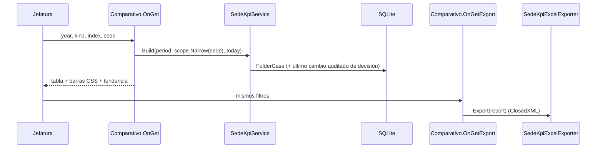

# Design: sgl-kpi-dashboard-comparativo

## Decisiones
| Decisión | Motivo |
|---|---|
| `SedeKpiService(connectionString)` con su propia consulta (una fila liviana por caso + subconsulta de auditoría) y agregación en memoria | Reutiliza la regla de antigüedad del dominio (`FolderCase.AgingFor`, extraída de `AgingAlert` con "hoy" inyectable) sin duplicarla en SQL; el volumen anual (miles de filas) no lo justifica en SQL |
| Fecha de decisión desde `CaseAuditLog` (valores guardados como nombre de enum) | No existe columna; `FinalDecisionDate` queda fuera de alcance |
| `OfficeScope` (Domain) compartido con la ficha de persona y roles por sede | Un solo tipo de alcance |
| Página `/Estadisticas/Comparativo` + pestaña en `_EstadisticasTabs` | Convive con `/Estadisticas` sin cambiar rutas existentes |
| Roles: Administrador, Jefatura, Coordinador (igual que `/Estadisticas`) | Coherencia |

## Secuencia

