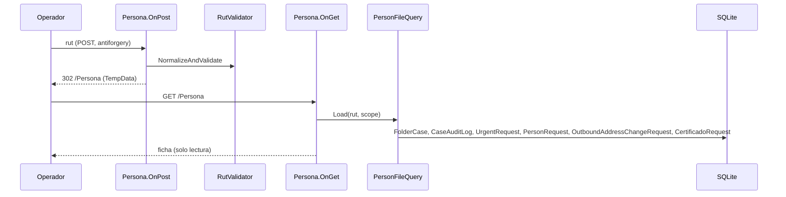

# Design: sgl-ficha-persona

## Decisiones
1. **Transporte del RUT: PRG + TempData.** `OnPost` valida y normaliza → `TempData["PersonaRut"]` → `RedirectToPage()`. `OnGet` lee con `TempData.Peek` (recargar la página sigue mostrando la ficha). El layout lleva un formulario oculto con antiforgery (`#persona-form`) que la búsqueda global usa para "Ver ficha".
2. **Comparación de RUT canónica en SQL** (sin cambio de esquema):
   `upper(ltrim(replace(replace(replace(Rut,'.',''),'-',''),' ',''),'0'))` = forma canónica en C#
   (dígitos + DV, sin ceros a la izquierda). Cubre el padding "0" de `RutValidator` y la k minúscula.
   Anula índices; aceptable con el volumen actual. Si crece: índice por expresión (aditivo).
3. **Servicio `PersonFileQuery(connectionString)`** en `Persistence/`, SQL crudo como el resto. Cada bloque en su `try/catch (SqliteException)` para tolerar tablas no creadas.
4. **`PersonFileScope(IReadOnlyCollection<Office>? AllowedOffices)`**; `PersonFileScope.All`. Punto de enchufe de `sgl-roles-por-sede`.
5. **Autorización:** `[Authorize]` (cualquier usuario autenticado; hoy todos ven todas las sedes).
   Las secciones F8/Cambio de Domicilio se muestran solo si el usuario tiene acceso al módulo (mismas reglas que el menú).

## Secuencia

## Rutas Razor
Nueva `/Persona` (`Dashboard/Pages/Persona.cshtml`). No altera rutas existentes.
